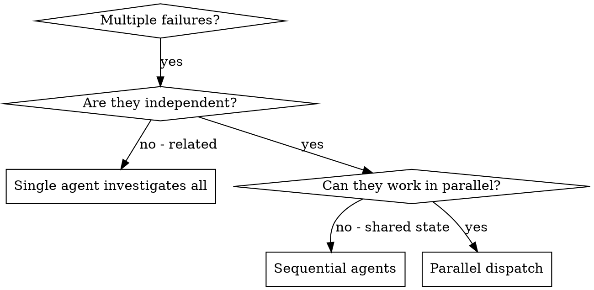

# Dispatching Parallel Agents

把任务委派给上下文隔离的专用 agent。通过精确构造它们的指令与上下文，让每个 agent 聚焦并完成各自的任务；它们不继承当前 session 的上下文或历史——你只交付它们所需的最小信息。这同时也为协调工作保留了自己的上下文。

当面对多个互不相关的失败（不同测试文件、不同子系统、不同 bug）时，逐个排查浪费时间；每个调查彼此独立，可以并行进行。

**核心原则**：每个独立问题域派发一个 agent，让它们并发工作。

**Announce at start:** "Using hatflow-dispatching-parallel-agents to [purpose]."

## When to Use

| 适用 | 不适用 |
|------|--------|
| 3+ 个测试文件因不同根因失败 | 失败彼此关联（修一个可能连带修好其他） |
| 多个子系统各自独立损坏 | 需要先理解整个系统状态 |
| 每个问题无需其他问题的上下文即可理解 | agent 之间会相互干扰（编辑同一文件、争用同一资源） |
| 各调查之间无共享状态 | 探索性调试——尚不清楚哪里坏了 |

## The Pattern

### 1. Identify Independent Domains

按"坏了什么"对失败分组，每个域彼此独立——修复一个域不影响另一个域：

- File A tests：Tool approval flow
- File B tests：Batch completion behavior
- File C tests：Abort functionality

### 2. Create Focused Agent Tasks

每个 agent 拿到：

- **Scope**：单个测试文件或子系统
- **Goal**：让这些测试通过
- **Constraints**：不改动其他代码
- **Output**：一份「发现了什么、修了什么」的总结

### 3. Dispatch in Parallel

用 Agent 工具并发派发；每个 agent 独立运行，不共享上下文。

### 4. Review and Integrate

agent 返回后：

1. 读每份总结
2. 检查改动是否冲突（是否编辑了同一段代码）
3. 运行完整测试套件
4. 整合所有改动；agent 可能犯系统性错误，做抽查

## Agent Prompt Structure（Prompt 四要素）

| 维度 | 正确默认 |
|------|---------|
| **Scope** | 指定具体目标，如 "Fix agent-tool-abort.test.ts"；范围聚焦，agent 才不会迷失 |
| **Context** | 贴上报错信息与测试名；agent 需要知道问题在哪 |
| **Constraints** | 写明边界，如 "Do NOT change production code" / "Fix tests only"，约束 agent 的改动面 |
| **Output** | 要求返回根因与改动总结，让你知道改了什么 |

## Dependencies

- 无预注入依赖
- 无 skill 调用依赖
