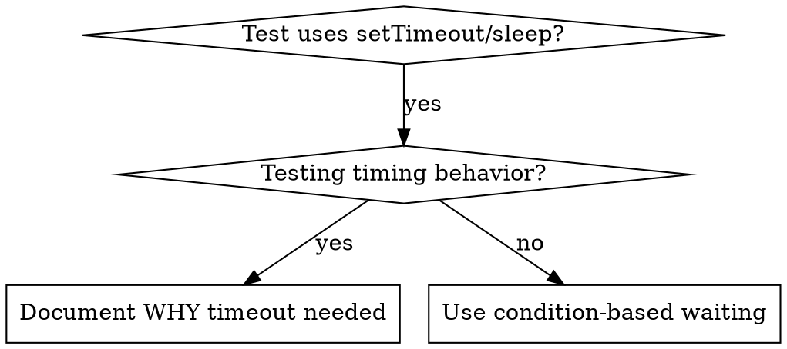

# Condition-Based Waiting

## Overview

不稳定的测试常用任意延时来猜时序，这会造成竞态：测试在快机器上通过，但在负载下或 CI 里失败。

**核心原则：** 等你真正在意的那个条件，而不是猜它需要多久。

## When to Use



适用场景：

- 测试里有任意延时（`setTimeout`、`sleep`、`time.sleep()`）。
- 测试不稳定（时通时不通、负载下失败）。
- 并行运行时测试超时。
- 在等异步操作完成。

例外：在测试真正的时序行为时（debounce、throttle 间隔）用任意超时是对的，但要注明为什么需要这个超时。

## Core Pattern

```typescript
// ❌ BEFORE: Guessing at timing
await new Promise(r => setTimeout(r, 50));
const result = getResult();
expect(result).toBeDefined();

// ✅ AFTER: Waiting for condition
await waitFor(() => getResult() !== undefined);
const result = getResult();
expect(result).toBeDefined();
```

## Quick Patterns

| 场景 | 写法 |
|------|------|
| 等事件 | `waitFor(() => events.find(e => e.type === 'DONE'))` |
| 等状态 | `waitFor(() => machine.state === 'ready')` |
| 等计数 | `waitFor(() => items.length >= 5)` |
| 等文件 | `waitFor(() => fs.existsSync(path))` |
| 复合条件 | `waitFor(() => obj.ready && obj.value > 10)` |

## Implementation

通用轮询函数：
```typescript
async function waitFor<T>(
  condition: () => T | undefined | null | false,
  description: string,
  timeoutMs = 5000
): Promise<T> {
  const startTime = Date.now();

  while (true) {
    const result = condition();
    if (result) return result;

    if (Date.now() - startTime > timeoutMs) {
      throw new Error(`Timeout waiting for ${description} after ${timeoutMs}ms`);
    }

    await new Promise(r => setTimeout(r, 10)); // Poll every 10ms
  }
}
```

本目录的 `condition-based-waiting-example.ts` 是完整实现，含来自实际调试会话的领域专用辅助函数（`waitForEvent`、`waitForEventCount`、`waitForEventMatch`）。

## Robust Polling Defaults

| 维度 | 默认做法 | 缘由 |
|------|---------|------|
| 轮询间隔 | 每 10ms 一次 | 间隔过短（如 1ms）空耗 CPU。 |
| 超时 | 始终设超时，附清晰错误信息 | 无超时会在条件永不满足时死循环。 |
| 取值时机 | 在循环内调 getter 取新值 | 循环外缓存状态会读到陈旧数据。 |

## When Arbitrary Timeout IS Correct

```typescript
// Tool ticks every 100ms - need 2 ticks to verify partial output
await waitForEvent(manager, 'TOOL_STARTED'); // First: wait for condition
await new Promise(r => setTimeout(r, 200));   // Then: wait for timed behavior
// 200ms = 2 ticks at 100ms intervals - documented and justified
```

成立条件：

1. 先等触发条件。
2. 基于已知时序（而非猜测）。
3. 注释说明为什么。
