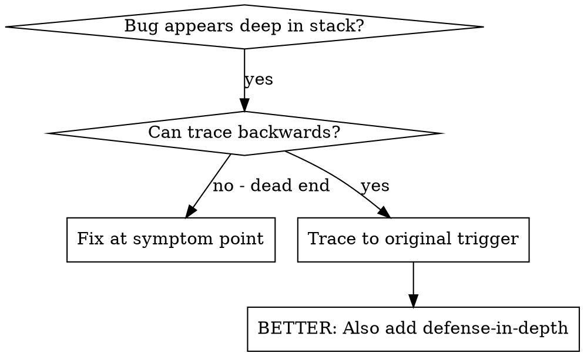
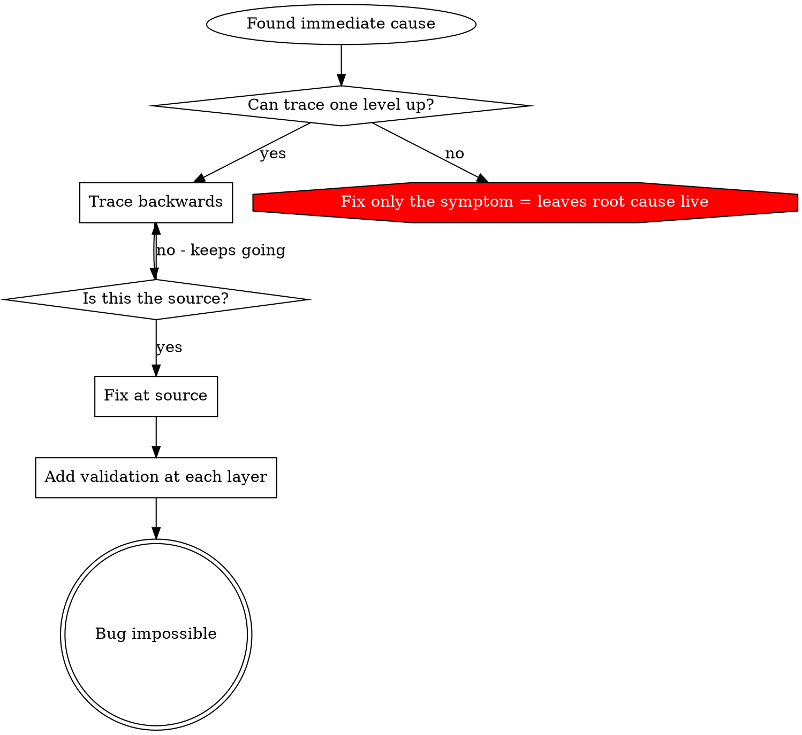

# Root Cause Tracing

## Overview

bug 常常表现在调用栈深处（git init 在错误目录、文件创建到错误位置、数据库以错误路径打开）。本能反应是在错误出现的地方修，但那是在治症状。

**核心原则：** 沿调用链向后回溯，直到找到最初的触发点，在源头修复。

## When to Use



适用场景：

- 错误发生在执行深处，而非入口点。
- stack trace 显示很长的调用链。
- 不清楚无效数据从哪里产生。
- 需要找出是哪个测试/代码触发了问题。

## The Tracing Process

### 1. 观察症状
```
Error: git init failed in ~/project/packages/core
```

### 2. 找直接原因
直接导致它的是哪段代码？
```typescript
await execFileAsync('git', ['init'], { cwd: projectDir });
```

### 3. 问：谁调用了它？
```typescript
WorktreeManager.createSessionWorktree(projectDir, sessionId)
  → called by Session.initializeWorkspace()
  → called by Session.create()
  → called by test at Project.create()
```

### 4. 继续向上追
传进来的值是什么？
- `projectDir = ''`（空字符串！）
- 空字符串作 `cwd` 会解析成 `process.cwd()`
- 那正是源码目录！

### 5. 找到最初触发点
空字符串从哪来？
```typescript
const context = setupCoreTest(); // Returns { tempDir: '' }
Project.create('name', context.tempDir); // Accessed before beforeEach!
```

## Adding Stack Traces

无法手动追踪时，加埋点：

```typescript
// Before the problematic operation
async function gitInit(directory: string) {
  const stack = new Error().stack;
  console.error('DEBUG git init:', {
    directory,
    cwd: process.cwd(),
    nodeEnv: process.env.NODE_ENV,
    stack,
  });

  await execFileAsync('git', ['init'], { cwd: directory });
}
```

测试中用 `console.error()` 而非 logger——logger 可能被抑制、看不到输出。

运行并捕获：
```bash
npm test 2>&1 | grep 'DEBUG git init'
```

分析 stack trace：找测试文件名、定位触发调用的行号、识别模式（同一个测试？同一个参数？）。

## Finding Which Test Causes Pollution

测试中出现了某个副作用、但不知道是哪个测试干的，用本目录的二分脚本 `find-polluter.sh`：

```bash
./find-polluter.sh '.git' 'src/**/*.test.ts'
```

它逐个跑测试，在第一个污染者处停下。用法见脚本。

## Real Example: Empty projectDir

**症状：** `.git` 创建在 `packages/core/`（源码目录）。

**追踪链：**
1. `git init` 跑在 `process.cwd()` ← cwd 参数为空
2. WorktreeManager 收到空 projectDir
3. Session.create() 传了空字符串
4. 测试在 beforeEach 之前访问了 `context.tempDir`
5. setupCoreTest() 初始返回 `{ tempDir: '' }`

**根因：** 顶层变量初始化时访问了尚为空的值。

**修复：** 把 tempDir 改成 getter，在 beforeEach 之前访问就抛错。

**同时加了 defense-in-depth：**
- Layer 1: Project.create() 校验目录
- Layer 2: WorkspaceManager 校验非空
- Layer 3: NODE_ENV 守卫，拒绝在 tmpdir 之外 git init
- Layer 4: git init 前记录 stack trace

## Key Principle



只在错误出现处修复，会让根因继续存活；回溯到最初触发点，在源头修复。

## Stack Trace Tips

- **测试中：** 用 `console.error()` 而非 logger，logger 可能被抑制。
- **操作前：** 在危险操作之前记录，而非等它失败之后。
- **带上下文：** 目录、cwd、环境变量、时间戳。
- **捕获栈：** `new Error().stack` 给出完整调用链。
