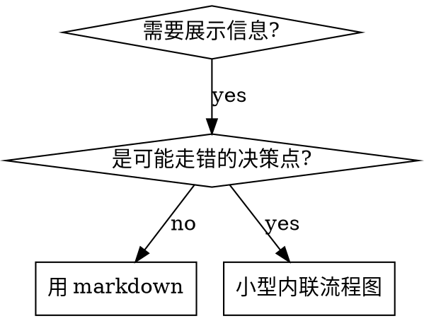

# Skill Specification Guide

Skill 不是操作手册，而是**行为约束系统**——不仅定义"做什么"，还要阻止"model 会怎么绕过"。

本 skill 覆盖 skill 的创建、修改和 review。spec 类（`spec-` 前缀，如本 skill）和流程类（如 task、distill）的结构要求基本相同，区别在于内容侧重：spec 类偏规则/标准，流程类偏步骤/分支。

**Announce at start:** "Using spec-skill to [write/modify/review] the skill."

**LANGUAGE RULE — strictly enforced, no exceptions:**
Write every message you show to the user in the user's configured language (the project's language preference, e.g. via `/config` or CLAUDE.md). Technical terms and code identifiers stay in their original form.

## Red Flags — If You Are Thinking Any of These, You Are Making a Mistake

| If you are thinking... | The reality is... |
|---|---|
| "This skill is simple, it doesn't need all the structure" | Simple skills are where shortcuts cause the most hidden debt |
| "I'll just use English for everything, it's easier" | The bilingual strategy exists for a reason: constraints in English, descriptions in Chinese. Follow it. |
| "Red Flags aren't needed for spec-type skills" | Spec skills are still read by models. If a model can misinterpret a rule, it will. |
| "I can skip dogfooding, the skill looks correct" | Looking correct ≠ working correctly. Run it on a real task. |
| "ALL CAPS will make the model pay more attention" | Research shows ALL CAPS has a 41% failure rate — the worst of all formats. Use Title Case. |

---

## Required Structure

每个 skill 必须包含以下元素：

### 1. Frontmatter

```yaml
---
name: skill-name
description: Use when [trigger]. Do NOT use when [exclusion]. 触发词: "中文触发词1", "中文触发词2"
---
```

description 规则：以 "Use when..." 开头，包含触发条件和排除条件，**必须包含中文触发词**（帮助 Claude 匹配中文用户意图），不超过 500 字符，不要概述流程。

**可选字段 `self-evolving`**：若该技能开启了自进化能力（见下方 Self-Evolution Capability），在 frontmatter 加 `self-evolving: true` 作为开关标记——它是「技能开头原始数据」里供 review 条件触发的信号。未开启则不写此字段。

**可选字段 `user-invocable`**：Claude Code 原生 frontmatter 字段（官方 telegram / vercel / codex 插件均在用）。`user-invocable: false` 把技能从 `/<name>` 斜杠命令列表里隐藏（隐藏后**仍能**被 description / 触发词自动激活、被其它技能调用，只是不在用户的 `/` 菜单里）；缺省即可被用户斜杠调用。**review 不得把它当违规字段误删**——它是合法可选项。

**哪些该设 `false`（隐藏）**：不适合用户单独直接调用的技能——① **spec 类**（`spec-*` 规范/标尺，靠触发词激活而非 `/`）；② **被编排器派发的 worker**（如 task 族的 init/design/plan/execute/test/revise——由 orchestrator 路由，不单独跑）；③ **subagent-only / 内部委托工具**（如 reviewer、codex-* 、dogfooding）。**保持可见（缺省）**：面向用户的入口与生命周期命令（如 `task`、`task-end`/`-cancel`/`-reopen`/`-setup`、各工作流技能）。判据：用户会不会主动敲 `/<name>` 来用它？不会 → `false`。

```yaml
---
name: work
description: Use when ... 触发词: "work"
self-evolving: true
---
```

<rule>
Description must state WHEN to use the skill, never summarize its workflow or steps.
Reason: when a description summarizes the workflow, Claude follows the description as a shortcut and skips reading the skill body. Real case: a description saying "code review between tasks" made Claude do ONE review, even though the body specified TWO (spec compliance, then code quality). Rewriting it to a pure trigger ("Use when executing implementation plans") made Claude read the body and run both reviews.
</rule>

```yaml
# ❌ BAD: 概述流程——Claude 会照 description 走、跳过 skill 正文
description: Use when executing plans - dispatches subagent per task with review between tasks

# ✅ GOOD: 只写触发条件，不概述流程
description: Use when executing implementation plans with independent tasks
```

### 2. Overview + Announce + Language Rule

```markdown
# Skill Name

一句话描述这个 skill 做什么、不做什么。（用户配置语言）

**Announce at start:** "Using [skill-name] to [purpose]."

**LANGUAGE RULE — strictly enforced, no exceptions:**
Write every message you show to the user in the user's configured language (the project's language preference, e.g. via `/config` or CLAUDE.md). Technical terms and code identifiers stay in their original form.
```

Overview 用用户配置语言描述，Announce 和 LANGUAGE RULE 用英文（它们是约束 model 行为的指令）。

### 3. Red Flags Table (Recommended)

建议每个 skill 都有一个 Red Flags 表格，预测 model 会怎么合理化跳步。3-7 条，全英文。

注意：Red Flags 作为设计工具的价值已经确认，但其对 model 行为的直接约束效果尚无学术证据支持。主要价值是迫使 skill 作者思考失败模式。

### 4. Iron Laws

在关键流程节点使用 `<rule>` 标签标记不可违反的规则：

```markdown
<rule>
Never write directly to Cards.
Reason: cards must go through your team's review before entering the knowledge base.
</rule>
```

措辞要求：使用 Title Case（不用 ALL CAPS），每条必须附 Reason。详见下方 Constraint Mechanism Guide。

### 5. Process

每个步骤需要包含：触发条件、完成条件、失败处理、用户确认点 (AskUserQuestion)。

### 6. README.md

**Every skill must have a companion `README.md`** — 纯中文的流程综述，供人类快速理解 skill 的目的、触发条件、核心流程和关键规则。

Do NOT duplicate SKILL.md content. 只提炼核心信息，不是逐字翻译。

### 7. Dependencies

在 SKILL.md 中声明 skill 的依赖关系：

```markdown
## Dependencies
- 预注入: LINEAR_PROTOCOL.md, DESIGN_PROTOCOL.md
- 调用: distill skill (Step 2.6)
- 引用: spec-git（commit 规范）
```

帮助维护者了解改动的影响范围。

### 8. Permission Constraints (Optional)

如果 skill 涉及文件读写，建议声明权限边界：

```markdown
## Permission Constraints
- **Write-only** `Inbox/distilled/` (新卡片)
- **Read-only** Cards/ (查重、引用)
- **Never write directly** to Cards/
```

---

## Bilingual Strategy

核心原则：**约束 model 行为的内容用英文，描述流程和解释上下文的内容用用户配置语言。**

### Language Classification

| 内容类型 | 语言 | 示例 |
|---------|------|------|
| `<rule>` 铁律块 | 英文（Reason 可中可英） | `Never write directly to Cards.` |
| Red Flags 表格 | 全英文 | 两列都是约束 model 行为 |
| LANGUAGE RULE 块 | 全英文 | 核心行为禁令 |
| Check/Detect/If missing 模式 | 全英文 | 检查步骤本质是指令 |
| 禁令短语 | 英文 | Do NOT / Never / Must |
| 停止指令 | 英文 | Stop here. Wait for the user. |
| 章节标题（所有层级） | 英文 | `## Phase 2: Design` |
| 加粗规则名/标签 | 英文 | `**Restate**`, `**No debug leftovers**` |
| Design Principles 原则名 | 英文 | `**Evidence Over Claims**` |
| 流程步骤说明 | 中文 | 步骤描述、上下文解释 |
| Overview 概述 | 中文 | skill 功能描述 |
| 用户提示词 | 中文 | 给用户看的文字 |
| 规则名后的解释 | 中文 | `**No debug leftovers** — 提交前清理...` |

### Decision Mnemonic

**判断口诀**：问自己"这句话是在**命令 model 做/不做**什么，还是在**描述流程/解释原因**？"前者英文，后者中文。

---

## Constraint Mechanism Guide

### Constraint Tiers

| 层级 | 格式 | 用途 | 措辞模式 |
|------|------|------|---------|
| `<HARD-GATE>` | XML 标签，英文 | **绝对不可绕过**的阻断点——跳过会让整条流程静默失效 | Gate + Reason + 阻断后果, Title Case |
| `<rule>` | XML 标签，英文 | 违反会造成不可逆损害的铁律 | Rule + Reason, Title Case |
| **Red Flags** | 表格，全英文 | 预判 model 合理化跳步的场景 | 引号内心活动 + 平实英文纠正 |
| **Bold rules** | 加粗英文规则名 + 中文解释 | 一般性强调 | `**Rule name** — 解释 + because/since` |

#### HARD-GATE vs rule

`<rule>` 表达"不该违反"；`<HARD-GATE>` 表达"违反则后续步骤无意义"。判据：

| 用 HARD-GATE | 用 rule |
|---|---|
| 跳过该点会让下游产物/检查**静默失效**（如未读 phase SKILL.md 就执行 → 跳光该 phase 全部 hook） | 违反造成损害但流程仍能继续 |
| 必须在**当前 turn** 完成某动作（读文件、跑门控）才能继续 | 一般性的"做/不做"约束 |
| 元 bug 类——agent 凭记忆即兴、声称做了实际没做 | 范围、风格、清理类约束 |

HARD-GATE 必须写明**阻断后果**（"否则 X 会静默失效"），让 agent 理解绕过的代价，而非单纯禁令。

<rule>
Violating the letter of the rules is violating the spirit of the rules.
Reason: agents under pressure find literal loopholes ("the rule says X but technically this is Y") to evade intent. Stating this meta-rule cuts off the entire class of "I'm following the spirit" rationalizations. If a reading of a rule lets you skip the work the rule exists to enforce, that reading is wrong.
</rule>

### Wording Guidelines

基于已验证的学术研究和 Anthropic 官方指南：

1. **Title Case, not ALL CAPS** — ALL CAPS 约束的失败率高达 41%（所有格式中最差），Title Case 仅 3.1%（最好）。对所有模型（含弱模型）都适用，ALL CAPS 是 "fighting the weights"
2. **Attach Reason to every rule** — Claude 从原因推理泛化，比从强调标记推理更有效。Reason 不只是文档，是一种有效的提示工程技术
3. **Prefer positive framing** — "Wait for user confirmation before committing" 优于 "Do not commit without confirmation"。但明确禁止某行为时仍用否定式
4. **Trailing reminder for terminal constraints** — 在流程末尾重复关键约束（如"展示 checklist"），恢复率 90-100%
5. **No ALL CAPS emphasis** — 在约束文本中不使用全大写强调词
6. **No redundant constraints** — 每条约束只写一次，不同层级必须提供不同信息。Haiku 对冗余最敏感

---

## Pre-injection Strategy

### Decision Framework

| 条件 | 策略 |
|------|------|
| 文件内容直接控制 model 当前步骤行为 | `!`cat`` 预注入 |
| 文件内容传递给 subagent 的 prompt | `!`cat`` 预注入 |
| 文件仅在特定条件分支使用，体积大 | 按需 Read |
| 文件是脚本，由 Bash 执行 | 路径引用即可 |

**口诀**：model 需要阅读才能正确行动 → 预注入；model 只需要知道路径 → 引用。

<rule>
Critical sub-protocol files must be pre-injected via `!`cat`` to guarantee they are read.
Reason: models sometimes skip reading files referenced by path, causing silent failures. Ensuring the file is read is more important than saving tokens.
</rule>

---

## Cross-Model Compatibility

Skill 会被不同 LLM 执行（Claude Opus, Sonnet, MiniMax 等）。为最弱的模型设计。

### Instruction Density

- **~1 concept per 6-8 lines** — 密度过高时弱模型容易丢失上下文
- 优先扁平结构而非深层嵌套（3-4 phases > 8 steps with sub-steps）
- 条件逻辑用表格，不用嵌套列表

### Stop Points

Only stop (AskUserQuestion) where user input genuinely changes the next action. 不必要的停止会打断流程。

Bad: "Setup complete. Ready to continue?" (answer is always yes)
Good: "Which approach do you prefer? A or B?" (answer determines next step)

### Exploration Budget

对于涉及代码探索的步骤，添加预算规则防止漫无目的的搜索：

```markdown
**Exploration budget**: Prefer dispatching an Explore subagent over making many individual tool calls.
If you have made more than 10 exploratory tool calls without a clear hypothesis, STOP and ask the user a clarifying question.
```

---

## Flowchart Usage

复杂分支、循环、状态机用 Graphviz dot 图表达决策点；纯参考材料、线性步骤、代码示例不用图（图烧 context，且不可复制粘贴）。

| 用 dot 流程图 | 不用流程图 |
|---|---|
| 非显而易见的决策点（"何时用 A vs B"） | 参考材料 → 用表格/列表 |
| 可能过早退出的处理循环 | 线性步骤 → 用编号列表 |
| 多状态流转 | 代码示例 → 用 markdown 代码块 |



节点 label 必须有语义，不用 step1/helper2 这类无意义标签。

---

## Design Principles

| Principle | Rule |
|-----------|------|
| **Evidence Over Claims** | Never say "should work"。运行命令，读输出，确认结果。 |
| **Context Isolation** | 每个 subagent 只给最小必要信息，no session history。 |
| **Bite-Sized Tasks** | 每步 2-5 分钟，一步一个动作。 |
| **Never Auto-Complete** | Agent cannot replace user testing。Stop and wait。 |
| **YAGNI** | 没有明确需求就不加功能。 |
| **No Redundant Constraints** | 每条约束只写一次。不同层级必须提供不同信息，not repeat the same rule。 |

## Proven Patterns

经过 ISSUE/238 两轮 dogfooding 验证的设计模式。Skill 作者可根据需要采用。

### Verification-Driven Development

TDD 的泛化——不要求测试框架，但要求每个实现步骤都有可验证的预期：

| 模式 | 适用场景 | 验证手段 |
|------|---------|---------|
| **Full TDD** | 有测试框架（Jest, pytest 等） | 测试用例 |
| **Lite TDD** | 无测试框架（markdown、配置文件等） | grep / wc / build 命令 |

两种模式共享 **5 步标准**：RED → RED-VERIFY → GREEN → GREEN-VERIFY → REFACTOR。具体 step 格式模板见 `PLAN_PROMPT.md ## TDD Requirements`。

Skill 中涉及实现步骤时，应在 Plan 阶段指定 VDD 模式（Full/Lite/跳过），并在每个 step 中包含验证循环。

### Failing-Test-First for Skills

写/改 skill 本身遵循 RED-GREEN-REFACTOR：先观察 agent 在**没有该 skill** 时如何失败（用 pressure scenario 跑 baseline，记录 agent 用的原话/合理化），再针对这些具体失败写 skill，最后跑同样场景验证合规、堵新漏洞。

<rule>
Observe how an agent fails without the skill before writing or editing it.
Reason: if you did not watch an agent fail, you are guessing at the failure mode — you do not know whether the skill teaches the right thing. The baseline failure tells you exactly which rationalizations to counter. This applies to EDITS too, not just new skills.
</rule>

### Mandatory Stop Points

当 skill 包含多个需要用户决策的节点时，使用集中式停止点表格 + `<rule>` 保护模式：

1. 在 skill 顶部定义 **Mandatory Stop Points** 表格，列出所有需要 AskUserQuestion 的节点
2. 每个停止点在流程中用 `<rule>` 包裹，防止 agent 自主跳过

```markdown
| Phase | When | What to Ask |
|-------|------|-------------|
| 2     | 设计完成后 | 确认复杂度和 review 策略 |
| 3→4   | Plan 确认后 | 执行模式 + TDD 策略 |
```

此模式确保所有用户决策点集中可见，避免遗漏。

### Two-Stage Review

代码 review 分两阶段执行，确保实现正确性优先于代码质量：

1. **Stage 1 — Spec Compliance**: 实现是否匹配 plan？
2. **Stage 2 — Code Quality**: 代码是否做好了？

<rule>
Stage 1 must pass before Stage 2 begins. Do not review code quality on incorrect implementation.
Reason: reviewing quality on wrong code wastes tokens and produces misleading feedback.
</rule>

使用 `<!-- STAGE-1-START/END -->` HTML 锚点在 checklist 文件中标记边界，避免硬编码 checklist 内容到多处（ISSUE R2 发现的同步风险）。

### Implementer States

执行 subagent 返回后，按声明状态分流处理：

| Status | 含义 | 处理 |
|--------|------|------|
| **DONE** | 完成 | 进入 review |
| **DONE_WITH_CONCERNS** | 完成但有疑虑 | 正确性问题先解决；观察性记录后继续 |
| **NEEDS_CONTEXT** | 缺少信息 | 提供上下文 + 进度报告，重派（最多 2 次） |
| **BLOCKED** | 无法完成 | AskUserQuestion：更多上下文 / 更强模型 / 拆分 / 终止 |

在 implementer subagent prompt 末尾要求声明状态：`Report your status as one of: DONE, DONE_WITH_CONCERNS, NEEDS_CONTEXT, BLOCKED.`

### Scope Freeze

设计批准后，范围变更需要显式用户确认。来源：ISSUE 中范围从 8→13 组扩大了 62%。

<rule>
After design approval, any scope expansion must be confirmed via AskUserQuestion before proceeding.
Reason: uncontrolled scope creep during execution leads to token waste and delayed delivery (ISSUE lesson).
</rule>

如果执行中发现新需求，记入 `next-task-prompt.md` 而非当场处理。

### Confirmation Loop

在任何需要用户审核产物（设计方案、计划、review 结果等）的环节使用统一的确认循环模式：

1. **展示结果**（产物内容或变更差异）
2. **纯文本询问**（非 AskUserQuestion）："是否有需要调整的地方？"
3. **用户说"继续"** → 推进到下一步
4. **用户给建议** → 澄清 → 修改 → 重新展示 → 回到步骤 2

关键规则：
- 确认使用纯文本（非 AskUserQuestion），让用户可以自由输入反馈
- 差异展示每轮重置——只展示本轮修改，不累积
- 若涉及自动审查（reviewer subagent），审查轮次计数跨循环累积不重置

适用场景：设计确认、计划确认、review 后确认、Revise cycle 确认等。

---

## Self-Evolution Capability

自进化技能从自身**每次运行**中沉淀经验、持续改进，而非一份静态文档。本章节是自进化合规的**单一来源**——review 以此为准；「以最新版本为准」由 reviewer 每次注入本文件天然保证，因此无需在技能里盖版本号（YAGNI）。

**Frontmatter 标记**：开启后在技能 frontmatter 写 `self-evolving: true`（见 Required Structure §1）。它是 review 条件触发的开关信号。

### Components

| 组件 | 形态 | 关键约束 |
|------|------|---------|
| **经验库** `references/lessons.md` | SKILL.md 启动时 `!`cat`` 注入 | 表格化（见下）；**硬上限（默认 ≤15 条）**；靠裁决漏斗增长、归纳覆写收缩；越短越健康。**这是每个技能自己的数据**（可变） |
| **冷归档** `references/lessons-archive.md` | **永不注入、永不作为路径给 model 主动读** | 被挤出经验库的条目沉这里——**不删**，仅供人工回溯 / revise-skill 复活 |
| **修订日志** `references/changelog.md` | 不注入，按需 Read，最新在最上 | **仅在 skill 定义（SKILL.md / reference / 经验库结构）被修改时**写一条，记「改了什么 + 为何」。**没改 skill 就不写**——它不是每轮运行 / dogfood 的流水账 |
| **过程准则（受管 · 全局注入）** spec-skill 的 `references/self-evolution-canonical.md` | 各技能 SKILL.md 启动时**直接 `!`cat`` / `Read` 母本的绝对路径**（`${CLAUDE_PLUGIN_ROOT}/skills/spec-skill/references/self-evolution-canonical.md`） | **先验后做 + 裁决漏斗 + 写入闸 + 整合三机制 + changelog 纪律** 的权威文本，**唯一母本**集中在此。**全局共享**（类比 system prompt）：所有自进化技能注入同一份、**不各存副本**；自进化流程严禁改 / 删；要改规则只改母本，全体下次启动即生效。技能若有自己额外的自进化补充，另注入它自己那份，不动母本 |
| **收尾 Dogfooding** | 流程最后一个 Phase | 复盘本轮**两类摩擦点**（①技能与实际不符 ②执行返工：凭记忆猜字段/参数/文件名导致的回改）按裁决漏斗定去向 + 按需跑经验库维护（防膨胀三机制）。**注意：复盘 ≠ 写 changelog**——没真正改 skill 就不写 changelog |

可选组件：**激进迭代期**——前 N 轮前置激进迭代 + 全程交互，稳定后收敛到每轮结尾一次。

**为什么把过程准则外置成全局母本**：先验后做 / 裁决漏斗 / 写入闸 / 整合 / changelog 纪律这套**对所有自进化技能都一样**。若每个技能各自手写进 SKILL.md 正文，自进化流程改正文时会顺手改动它们 → 各技能慢慢漂移、且 changelog 纪律被改坏（实测：work 模板曾把 changelog 写成「每轮 dogfood 流水账」）。**收敛成单一 canonical 母本、各技能启动时直接注入它的绝对路径（不各存副本）**，既保证每次必读、又让自进化碰不到它，改一处即全体生效——无需批量同步副本。

### 经验库格式（表格，非自由堆叠）

```markdown
| 经验 | 重要度 | 来源 | 上次命中 |
|---|---|---|---|
| 一句话经验（可带 emoji 标类别） | 1-10 | case/日期 | 日期 |
```

不记精确命中计数（agent 自报不可靠、逐步记账必被省略）；改用**重要度**（创建时打 1-10）+ **上次命中**（recency，整合时粗判刷新）。lessons.md 头部另记一行 `上次整合: YYYY-MM-DD`——整合触发判据据它 + 硬上限判定（见防膨胀机制）。

### 防膨胀机制（经验库的核心约束）

1. **写入闸（防垃圾桶 · 每次写入）**：往 lessons.md 写一条前，先回答「为何不能上移到 ①SKILL 正文 / ②reference / ③CLAUDE.md」。答得上来就上移，不进经验库。
2. **整合（升级 + 淘汰 + 归纳覆写 · 触发式，非每轮强做）**：整合 = 反复命中的经验**升级**固化进流程后移除 + 超限/过时条目**淘汰**进 `lessons-archive.md`（不删，高重要度豁免——低频≠低价值，如安全类）+ **归纳覆写**合并重叠、刷新「上次命中」。**在 lessons.md 头部记一行「上次整合: YYYY-MM-DD」**；每轮收尾按下表评估「这轮要不要整合」，省得每次都重写全表：

| 必做整合（满足任一） | 可跳过（无必做项 + 满足任一） |
|---|---|
| 达硬上限（≤15）｜进入上线 / 对外提交阶段｜到特定节点（换期 / 里程碑）｜距上次整合 ≥ 1 天 | 本轮无新经验 / 仅轻量更新｜经验库已精简 / 条目很少｜刚整合过（数小时内） |

判据落地只看两样：**硬上限**（满没满）+ **上次整合时间**（隔多久）。整合后把头部「上次整合」日期更新为今天。

<rule>
Before adding any entry to lessons.md, justify why it cannot instead go to the SKILL body, a reference, or the project CLAUDE.md. If it can, put it there — lessons.md is the last-resort sink, not the default.
Reason: lessons.md is the path of least resistance; without this gate it silently becomes a dumping ground and the funnel's ①②③ ("harden into process") outlets get skipped. A soft lesson that could be a hard rule should become one.
</rule>

<rule>
Evict from lessons.md by moving entries into lessons-archive.md, never by deleting. lessons-archive.md is never injected and never read proactively.
Reason: eviction must be reversible — a lesson dropped for low recency may matter later. A cold archive keeps the audit trail and lets revise-skill resurrect entries without paying injection cost every run.
</rule>

<rule>
Write to changelog.md ONLY when the skill's own definition is actually modified (SKILL.md / a reference / the lessons-library structure), one entry per change recording what changed and why. A run that does not modify the skill writes nothing to changelog. The per-run dogfooding narrative (case details, what was tried) is NOT archived to changelog — it is distilled into the body/lessons or discarded.
Reason: treating changelog as a per-run流水账 makes it grow on every execution even when the skill never changed, destroying its value as a modification/rollback trail and bloating the repo. changelog answers "how did this skill change over time", not "what happened each run".
</rule>

<rule>
The self-evolution process rules (pre-flight verification + decision funnel + write-gate + consolidation + changelog discipline) live in a single canonical master under spec-skill (`references/self-evolution-canonical.md`). Each self-evolving skill injects this master DIRECTLY by `!`cat``-ing (or, for an alternate runtime-compatible skills, `Read`-ing) the master's ABSOLUTE path at startup — NO per-skill copy is kept. Do NOT hand-write these rules into each skill's SKILL.md body, and do NOT let the self-evolution process edit the master.
Reason: identical process rules duplicated by hand across skills drift apart and get corrupted by the very process they govern. One canonical master injected by absolute path into every skill guarantees consistency and makes a rule change take effect everywhere on the next run — with no copies to sync.
</rule>

### 编排族的经验归属（orchestrator + workers）

一个技能负责**编排**、把具体活派给一组子技能执行（如 `task` 编排 `task-init / task-design / task-execute / …`），这叫**编排族**。族里一道任务由多个技能重合完成，「这条经验落哪个技能」会出现单技能场景没有的歧义。判据只有一条：

> **经验归属 = 它下次会被检索、被应用的那个决策点，不是它被发现的地方。**
> 自检：「下次这条经验，该在**谁**的**哪个决策点**被读到？」——落在那个技能，而非偶然发现它的那次流程所在的技能。

三条推论覆盖绝大多数情况：

| 经验性质 | 例 | 落点 |
|---|---|---|
| **执行细节** | 「执行子任务时跑测试前要先 source 环境」 | 子技能——即使是在一次完整编排流程里发现的，它唯一的复用点就是那个子技能 |
| **编排决策** | 「design 没过审不该放进 plan」「某类任务该跳过 test 阶段」 | orchestrator——选谁 / 排序 / 分支 / 何时停 |
| **交接契约** | 「plan 传给 execute 的产物必须含验证命令」 | 看谁把关：把关动作在编排层→orchestrator；是子技能被调用时的前置假设→该子技能开头 |

orchestrator 自己也只是一个技能，**有自己的 `lessons.md`，专收编排经验**；**不给编排族另造 series 级公共经验库**（那是又一个垃圾桶入口）。每个技能各收各的，按上表分流。

<rule>
For an orchestrator + workers family, a lesson belongs to the skill whose decision point will retrieve it next, not the skill where it was discovered. Execution-detail lessons go to the worker; orchestration-decision lessons go to the orchestrator; never give a family a shared "series-level" lessons.md.
Reason: in a family the discovery locus and the retrieval locus diverge — a lesson found while running a worker may really be an orchestration rule. Filing by discovery scatters lessons where no decision point reads them; filing by retrieval keeps each lesson where it will actually fire.
</rule>

<rule>
Extend the write-gate with a locus question: before writing a family lesson, answer "which skill's which decision point reads this next?". If you cannot name a single owner, the lesson is either a process improvement to harden into a body (orchestrator or worker), or you have not yet located its real retrieval point — do NOT mirror the same soft lesson into multiple skills' lessons.md.
Reason: a lesson that "could go anywhere" is the write-gate's signal that it is too general (harden it) or undiagnosed (find its locus). Mirroring one lesson across several lessons.md guarantees drift — fix one copy, forget the others — which is more corrosive than bloat.
</rule>

### When to Offer

仅对**重复使用型流程类技能**（反复处理同类任务，如 work / review / distill）主动提议**完整经验库机制**；**spec(Spike)类技能不设独立经验库**——经验直接改正文（文档即知识，避免又一个垃圾桶入口），只保留 changelog；一次性工具技能默认 N/A。**所有被修改的技能都要有 changelog**（见 File Organization）。

<rule>
When creating or modifying a recurring-workflow (process-type) skill, ask the user via AskUserQuestion whether to include the self-evolution capability. If yes, scaffold the components and set `self-evolving: true`. Do NOT add a lessons.md to a spec-type skill — record its lessons in the body and keep only a changelog.
Reason: self-evolution pays off only for skills that run repeatedly on similar tasks. For a spec-type skill the document IS the knowledge, so a separate lessons.md is a redundant dumping ground. The frontmatter marker lets review verify the implementation against this spec.
</rule>

本规格自包含——所有自进化组件已在上文定义，无需依赖任何外部项目实例。

---

## Anti-Patterns

| Anti-pattern | Correct approach |
|--------|----------|
| Cookbook（流水线式命令序列） | 行为约束系统（规则 + 门禁） |
| Hardcoded paths/versions | 从项目状态动态检测 |
| No Red Flags table | 建议每个 skill 都有（设计工具） |
| "Suggest" doing X | 用 `<rule>` 或 bold rule 强制 |
| 500+ line monolith | 拆分为主 skill + 子协议文件 |
| No failure handling | 每步都考虑失败场景 |
| Assume agent compliance | 预测 model 会怎么绕过，主动阻止 |
| All-Chinese instructions | Bilingual：约束英文 + 描述中文 |
| Over-constraining | 越强的模型需要越简单的约束。过度约束导致分布偏移（Prompting Inversion），降低性能。约束应与模型能力匹配（见 Subagent Collaboration） |

## Token Efficiency

Context is a finite, critical resource. 用简单直接的语言，以合适的抽象层级呈现。

- 交叉引用而非重复（"follow `spec-git` conventions"）
- 一个好例子 > 三个平庸例子
- 表格 > 段落
- 避免过于复杂的硬编码逻辑

### Length Budget by Load Frequency

按**加载频率**定长度预算——高频加载的 skill 每个 token 都进每次对话：

| 类型 | 预算 | 理由 |
|------|------|------|
| getting-started 工作流 | <150 words/条 | 进入每次对话 |
| 高频加载 skill（如 spec-skill、task） | <200 words 核心 | 频繁注入 |
| 其余 skill | <500 words | 仍需精简 |

超预算时：细节移到 `--help`/子文件、交叉引用替代重复、压缩示例。验证：`wc -w skills/path/SKILL.md`。

### Cross-Reference, Never @-link

跨 skill 引用用**纯文本路径或 skill 名**（如 "见 `spec-git`"）。

<rule>
Never use @-link (`@path/to/file`) for cross-skill references.
Reason: `@` syntax force-loads the file immediately, burning 200k+ context before it is needed. Use a plain-text path or skill name so the file loads only when actually required. Only same-directory critical sub-files intended for pre-injection use `!`cat`` (see Pre-injection Strategy).
</rule>

## Advanced Features

### Dynamic Injection (`!`command``)

Skill 加载时执行 shell 命令，输出替换占位符：

```markdown
- Tasks: !`hat-task-detect .tasks 2>/dev/null || echo '{"open":[]}'`
```

命令要轻量（毫秒级），注意工作目录。

**`!`cat`` 路径约定**：读取 skill 内部文件时，用 `${CLAUDE_SKILL_DIR}` 代替硬编码的项目根路径，skill 移动或在不同项目复用时自动适应：

```bash
# ✅ 同 skill 内文件
!`cat "${CLAUDE_SKILL_DIR}/references/lessons.md" 2>/dev/null || echo "(暂缺)"`

# ✅ 跨 skill 文件（如 revise 读 work 的 reference）
!`cat "${CLAUDE_PLUGIN_ROOT}/skills/work/references/protocol.md" 2>/dev/null || echo "(暂缺)"`

# ❌ 避免：硬编码项目根路径
!`cat ".claude/skills/work/references/lessons.md" 2>/dev/null || echo "(暂缺)"`
```

`${CLAUDE_SKILL_DIR}` 解析为 SKILL.md 所在目录的绝对路径，项目级与全局 skill 均适用（已验证）。

<rule>
Skill content must not contain concrete project information or hardcoded local/absolute paths (e.g. `~/Projects/<name>/...`, `/Users/<you>/...`). Use `${CLAUDE_SKILL_DIR}` or paths relative to it. A project-level skill may reference its OWN project (via relative paths), but never another project.
Reason: hardcoded local paths make a skill unshareable and brittle — the moment the project moves or another person installs it, every such reference breaks. Portable references survive relocation and sharing. (Universal framework paths like `.claude/skills/` are fine; specific project roots are not.)
</rule>

### Dynamic Routing

**变量替换**：`$ARGUMENTS`（用户参数）、`$1`（位置参数）、`${CLAUDE_SKILL_DIR}`（skill 目录路径）。

**`${CLAUDE_POSITIONAL_ARGS}` 限制**：此变量在 subagent 模式下为空字符串（2026-03-28 dogfooding 验证）。因此 subagent 调用 skill 时**必须使用路径 B**——直接在 Agent prompt 中注入 protocol 内容，不可依赖动态路由加载。

| 调用场景 | 路径 A（Skill 内部路由） | 路径 B（直接注入） |
|---------|----------------------|------------------|
| 主 session | ✅ 可用 | ✅ 可用 |
| Subagent | ❌ 变量为空 | ✅ 唯一可行方案 |

### Sub-Files Strategy

主 SKILL.md 保持精简骨架。子文件按预注入策略处理：

```
${CLAUDE_PLUGIN_ROOT}/skills/task/
├── SKILL.md                 ← 主流程骨架
├── DESIGN_PROTOCOL.md       ← !`cat` 预注入（关键子协议）
├── LINEAR_PROTOCOL.md       ← !`cat` 预注入（关键子协议）
└── scripts/                 ← 辅助脚本（如需要）
```

关键子协议文件必须通过 `!`cat`` 预注入（见 Pre-injection Strategy）。只有非关键的大型参考文档才按需 Read。

### Subagent Collaboration

**Plan 生成策略**：主 agent 直接编写 plan.md（Low/Medium 复杂度）。Subagent 仅在 High 复杂度且用户选择时使用。原因：实验数据显示主 agent token 消耗约为 subagent 的 1/24，质量差异主要在步骤粒度。

**执行模型分层**：

| 条件 | 模型 |
|------|------|
| Files ≤ 2 | Sonnet（默认） |
| Files 3+ **且**步骤含架构关键词 | Opus |

架构关键词（中英文）：设计/design、架构/architecture、重构/refactor、debug/调试。必须同时满足 Files 和关键词条件。

**Design Review 分层**：

| 轮次 | 用途 | 默认模型 |
|------|------|---------|
| R1（结构审查） | 架构一致性、coverage | Sonnet |
| R2（对抗审查） | 深度推理、边界情况 | Opus |

用户可在 Review Strategy Confirmation 步骤覆盖模型选择。

**Model Capability Tiers** — 派发 subagent 时根据模型能力调整注入内容：

| 层级 | 注入策略 |
|------|---------|
| **Strong** (Opus, GPT-4 级) | 核心约束 + 任务描述，精简信任推理 |
| **Medium** (Sonnet, MiniMax) | 核心约束 + 详细步骤 + XML 结构化 |
| **Weak** (Haiku 等) | 核心约束 + 逐步指令 + XML + trailing reminders + 更多示例 |

所有层级都避免 ALL CAPS。差异在于**详细度和结构化程度**，不在语气强度。越强的模型需要越简单的约束——过度约束导致分布偏移（Prompting Inversion）。

**Background Subagent Checkpoint Gate** — 后台任务必须有对应的 checkpoint gate。在下一个**用户交互点之前**插入验证，而非在后台任务本身加约束。保留并行效率，同时用 gate 确保完成。

| 模式 | 效果 | 示例 |
|------|------|------|
| `run_in_background` + **阻塞 checkpoint** | ✅ 从未跳过 | `TaskOutput block:true` 在 Phase 1f |
| `run_in_background` + 仅文字说明 | ❌ 系统性跳过 | Phase 3d 被跳过（ISSUE） |
| `run_in_background` + **pre-gate before AskUserQuestion** | ✅ 保留效率 | Phase 3 Stop 前检查 3d 完成 |

### Process Review Loop

在 task-end/task-cancel 的 final.md 中包含 token 估算、合规检查、偏差分析，然后和用户讨论改进：fix skill now / record to debt.md / skip。

如果任务中有 MCP 或脚本调用失败，Process Review 必须评估工具代码是否需要修复。

---

## Dogfooding

Skill 写完/改完后，必须用它跑一次真实任务来验证。目的不是"测试通过"，而是以用户视角找出摩擦点和遗漏。

没有真实任务时，检测目标项目是否 git 仓库：
- **是 git** → 用 worktree 创建隔离副本，模拟执行流程，完成后丢弃
- **不是 git** → dry run（走流程但不执行写操作）

让用户选择方式。

检查点：
- 流程是否能顺畅走完？哪一步卡住了？
- 有没有 model 不遵守的约束？（需要加 `<rule>` 或 Red Flag）
- 有没有不必要的停止点拖慢了节奏？
- 有没有缺失的分支或失败处理？

发现的问题应立即修复，而非记录到 debt。

### Self-Compliance Check

Skill 修改完成后，用自身 Checklist 逐项审核。这既是验收步骤（确保改动不破坏已有规范），也是 dogfooding 的一种形式（检验 Checklist 本身是否完备）。

不合规项必须修复后才算完成。如果发现 Checklist 本身有遗漏，同时补充。

---

## Dependencies

- 引用: PLAN_PROMPT.md（VDD 模板）
- 无预注入依赖
- 无 skill 调用依赖

## File Organization

通用 skill 文件结构（约定文件名，路径相对技能目录）：

```
skills/skill-name/
  SKILL.md                  # Bilingual instructions（主流程/规范）
  README.md                 # 流程综述（纯中文）
  references/               # Optional: 子协议 / 标准 / 经验库 / 日志
    changelog.md            # 修订日志（被修改的 skill 通用，不注入，最新在最上，仅改才写）
    <protocol>.md           # 子协议（按预注入策略 !`cat` 或按需 Read）
    lessons.md              # 经验库（仅流程类/self-evolving）：!`cat` 注入，表格化，硬上限
    lessons-archive.md      # 冷归档（仅流程类）：永不注入/引用
  scripts/                  # Optional: 脚本
```
（自进化技能**不再保存** `references/self-evolution.md` 副本——过程准则统一注入全局母本，见下。）

> 自进化技能的 SKILL.md 启动注入区应有**两行注入**：① `${CLAUDE_SKILL_DIR}/references/lessons.md`（本技能数据，可变）② 过程准则**全局母本**的绝对路径 `${CLAUDE_PLUGIN_ROOT}/skills/spec-skill/references/self-evolution-canonical.md`（受管，勿改）。①用 `${CLAUDE_SKILL_DIR}` 引用本技能自有；②用绝对路径直引母本、**不各存副本**，改母本即全体生效。an alternate runtime 兼容技能两行都改用 `Read` + 绝对路径（禁 `!`cat`` / `${CLAUDE_SKILL_DIR}`）。

### 按类型分（流程类 vs spec(Spike)类）

| 类型 | changelog | lessons.md + 冷归档 |
|------|-----------|---------------------|
| **流程类**（work / task / review / distill 等反复处理同类任务） | ✅ | ✅ 完整自进化机制（见 Self-Evolution Capability） |
| **spec(Spike)类**（`spec-*`、规范/标准类） | ✅ | ❌ 经验直接改正文——文档即知识，不设独立经验库（否则又一个垃圾桶入口） |
| **一次性工具类** | 改了就记 | ❌ |

<rule>
Every skill that gets modified must maintain a `references/changelog.md` (newest on top), recording each change and why.
Reason: without a per-skill modification log there is no rollback trail — if an edit breaks behavior, you cannot tell what changed or revert intent. This applies to all skill types, not just self-evolving ones.
</rule>

### Naming: ASCII Only

文件名与文件夹名一律用 **ASCII 英文 kebab-case**，禁止中文 / 空格 / 点（概念名在正文里可用用户配置语言，落到磁盘的名字必须英文）。通用约定译名：经验库→`lessons.md`、冷归档→`lessons-archive.md`、修订日志→`changelog.md`、子协议→`<name>-protocol.md`。项目特有文件名（如某甲方标准、报告模板、产出文件夹）由该项目自己的规范定义，不进本全局 spec。

<rule>
File and folder names must be ASCII (English kebab-case). Never use Chinese characters, spaces, or dots in names.
Reason: non-ASCII paths break tooling, cross-platform sync, and Claude Code's memory path encoding (which maps `/` and `.` to `-`). Chinese filenames also make grep/scripts brittle. Concept names may stay Chinese in prose; the on-disk name must be English.
</rule>

## Checklist — Before Creating or Modifying a Skill

- [ ] Red Flags table present? (recommended, 3-7 items)
- [ ] Iron Laws (`<rule>` tags) at critical points?
- [ ] Failure handling for each step?
- [ ] AskUserQuestion at user decision points?
- [ ] No hardcoded paths/versions?
- [ ] 无具体项目信息 / 本地绝对路径 / 跨项目引用？（用 `${CLAUDE_SKILL_DIR}`/相对路径；项目级 skill 只引用自身项目）
- [ ] 文件名 / 文件夹名全 ASCII 英文（无中文 / 空格 / 点）？
- [ ] Description includes 中文触发词?
- [ ] LANGUAGE RULE block present?
- [ ] Bilingual strategy applied? (titles English, descriptions Chinese, constraints English)
- [ ] Critical sub-files pre-injected via `!`cat``?
- [ ] Dependencies declared?
- [ ] README.md created/updated?
- [ ] `references/changelog.md` 存在且本次改动已记一条（最新在最上）？
- [ ] 文件结构符合 File Organization？经验库归属按类型正确（流程类才有 lessons.md；spec 类只有 changelog）？
- [ ] Dogfooding planned?
- [ ] Mandatory Stop Points defined? (if skill has user decision points)
- [ ] VDD strategy noted? (Full TDD / Lite TDD / N/A)
- [ ] 重复使用型流程类：已用 AskUserQuestion 询问是否加入自进化能力？
- [ ] 若 `self-evolving: true`：本技能自有组件齐备（经验库表格化 + 硬上限 / 冷归档 / 修订日志 / 收尾 Dogfooding）；且过程准则（先验后做 / 裁决漏斗 / 写入闸 / 整合三机制 / changelog 纪律）由启动注入区**直接注入全局母本绝对路径**（`spec-skill/references/self-evolution-canonical.md`）提供——**非各存副本、非手写进正文**？
- [ ] frontmatter 的 `self-evolving` 标记与实际组件状态一致（不空挂）？
- [ ] 若属编排族（orchestrator + workers）：经验按「检索点归属」分流（执行细节→worker，编排决策→orchestrator），无 series 级公共经验库，无同一软经验跨技能镜像？
- [ ] Self-compliance check passed? (use this checklist on the skill itself)
