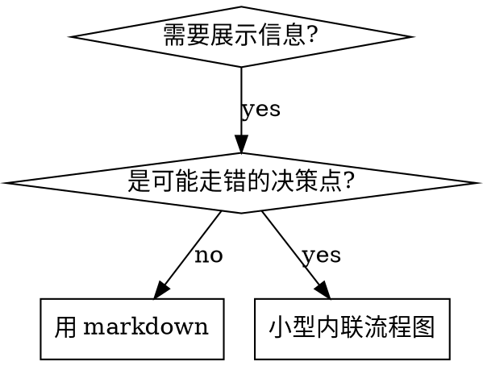

# Skill Specification Guide

Skill 不是操作手册，而是**行为约束系统**——不仅定义"做什么"，还要阻止"model 会怎么绕过"。

本 skill 覆盖 skill 的创建、修改和 review。spec 类（`spec-` 前缀，如本 skill）和流程类（如 task、distill）的结构要求基本相同，区别在于内容侧重：spec 类偏规则/标准，流程类偏步骤/分支。

**Announce at start:** "Using spec-skill to [write/modify/review] the skill."

**LANGUAGE RULE — strictly enforced, no exceptions:**
Every message you show to the user MUST be written in Chinese (中文).
This includes status updates, analysis results, questions, error reports, and summaries.
Technical terms (e.g., CSS, Tailwind, scoped CSS) and code identifiers stay in English.
Do NOT write English sentences like "Let me check..." or "Based on my analysis...".
Write "让我检查..." or "分析结果如下..." instead.

## Red Flags — If You Are Thinking Any of These, You Are Making a Mistake

| If you are thinking... | The reality is... |
|---|---|
| "This skill is simple, it doesn't need all the structure" | Simple skills are where shortcuts cause the most hidden debt |
| "I'll just use English for everything, it's easier" | The bilingual strategy exists for a reason: constraints in English, descriptions in Chinese. Follow it. |
| "Red Flags aren't needed for spec-type skills" | Spec skills are still read by models. If a model can misinterpret a rule, it will. |
| "I can skip dogfooding, the skill looks correct" | Looking correct ≠ working correctly. Run it on a real task. |
| "ALL CAPS will make the model pay more attention" | Research shows ALL CAPS has a 41% failure rate — the worst of all formats. Use Title Case. |

---

## Required Structure

每个 skill 必须包含以下元素：

### 1. Frontmatter

```yaml
---
name: skill-name
description: Use when [trigger]. Do NOT use when [exclusion]. 触发词: "中文触发词1", "中文触发词2"
---
```

description 规则：以 "Use when..." 开头，包含触发条件和排除条件，**必须包含中文触发词**（帮助 Claude 匹配中文用户意图），不超过 500 字符，不要概述流程。

<rule>
Description must state WHEN to use the skill, never summarize its workflow or steps.
Reason: when a description summarizes the workflow, Claude follows the description as a shortcut and skips reading the skill body. Real case: a description saying "code review between tasks" made Claude do ONE review, even though the body specified TWO (spec compliance, then code quality). Rewriting it to a pure trigger ("Use when executing implementation plans") made Claude read the body and run both reviews.
</rule>

```yaml
# ❌ BAD: 概述流程——Claude 会照 description 走、跳过 skill 正文
description: Use when executing plans - dispatches subagent per task with review between tasks

# ✅ GOOD: 只写触发条件，不概述流程
description: Use when executing implementation plans with independent tasks
```

### 2. Overview + Announce + Language Rule

```markdown
# Skill Name

一句话描述这个 skill 做什么、不做什么。（用户配置语言）

**Announce at start:** "Using [skill-name] to [purpose]."

**LANGUAGE RULE — strictly enforced, no exceptions:**
Every message you show to the user MUST be written in Chinese (中文).
Technical terms and code identifiers stay in English.
Do NOT write English sentences like "Let me check...".
Write "让我检查..." instead.
```

Overview 用用户配置语言描述，Announce 和 LANGUAGE RULE 用英文（它们是约束 model 行为的指令）。

### 3. Red Flags Table (Recommended)

建议每个 skill 都有一个 Red Flags 表格，预测 model 会怎么合理化跳步。3-7 条，全英文。

注意：Red Flags 作为设计工具的价值已经确认，但其对 model 行为的直接约束效果尚无学术证据支持。主要价值是迫使 skill 作者思考失败模式。

### 4. Iron Laws

在关键流程节点使用 `<rule>` 标签标记不可违反的规则：

```markdown
<rule>
Never write directly to SlipBox.
Reason: cards must go through hatcloud's review before entering the knowledge base.
</rule>
```

措辞要求：使用 Title Case（不用 ALL CAPS），每条必须附 Reason。详见下方 Constraint Mechanism Guide。

### 5. Process

每个步骤需要包含：触发条件、完成条件、失败处理、用户确认点 (AskUserQuestion)。

### 6. README.md

**Every skill must have a companion `README.md`** — 纯中文的流程综述，供人类快速理解 skill 的目的、触发条件、核心流程和关键规则。

Do NOT duplicate SKILL.md content. 只提炼核心信息，不是逐字翻译。

### 7. Dependencies

在 SKILL.md 中声明 skill 的依赖关系：

```markdown
## Dependencies
- 预注入: LINEAR_PROTOCOL.md, DESIGN_PROTOCOL.md
- 调用: distill skill (Step 2.6)
- 引用: spec-git（commit 规范）
```

帮助维护者了解改动的影响范围。

### 8. Permission Constraints (Optional)

如果 skill 涉及文件读写，建议声明权限边界：

```markdown
## Permission Constraints
- **Write-only** `_Inbox/distilled/` (新卡片)
- **Read-only** SlipBox/ (查重、引用)
- **Never write directly** to SlipBox/
```

---

## Bilingual Strategy

核心原则：**约束 model 行为的内容用英文，描述流程和解释上下文的内容用用户配置语言。**

### Language Classification

| 内容类型 | 语言 | 示例 |
|---------|------|------|
| `<rule>` 铁律块 | 英文（Reason 可中可英） | `Never write directly to SlipBox.` |
| Red Flags 表格 | 全英文 | 两列都是约束 model 行为 |
| LANGUAGE RULE 块 | 全英文 | 核心行为禁令 |
| Check/Detect/If missing 模式 | 全英文 | 检查步骤本质是指令 |
| 禁令短语 | 英文 | Do NOT / Never / Must |
| 停止指令 | 英文 | Stop here. Wait for the user. |
| 章节标题（所有层级） | 英文 | `## Phase 2: Design` |
| 加粗规则名/标签 | 英文 | `**Restate**`, `**No debug leftovers**` |
| Design Principles 原则名 | 英文 | `**Evidence Over Claims**` |
| 流程步骤说明 | 中文 | 步骤描述、上下文解释 |
| Overview 概述 | 中文 | skill 功能描述 |
| 用户提示词 | 中文 | 给用户看的文字 |
| 规则名后的解释 | 中文 | `**No debug leftovers** — 提交前清理...` |

### Decision Mnemonic

**判断口诀**：问自己"这句话是在**命令 model 做/不做**什么，还是在**描述流程/解释原因**？"前者英文，后者中文。

---

## Constraint Mechanism Guide

### Constraint Tiers

| 层级 | 格式 | 用途 | 措辞模式 |
|------|------|------|---------|
| `<HARD-GATE>` | XML 标签，英文 | **绝对不可绕过**的阻断点——跳过会让整条流程静默失效 | Gate + Reason + 阻断后果, Title Case |
| `<rule>` | XML 标签，英文 | 违反会造成不可逆损害的铁律 | Rule + Reason, Title Case |
| **Red Flags** | 表格，全英文 | 预判 model 合理化跳步的场景 | 引号内心活动 + 平实英文纠正 |
| **Bold rules** | 加粗英文规则名 + 中文解释 | 一般性强调 | `**Rule name** — 解释 + because/since` |

#### HARD-GATE vs rule

`<rule>` 表达"不该违反"；`<HARD-GATE>` 表达"违反则后续步骤无意义"。判据：

| 用 HARD-GATE | 用 rule |
|---|---|
| 跳过该点会让下游产物/检查**静默失效**（如未读 phase SKILL.md 就执行 → 跳光该 phase 全部 hook） | 违反造成损害但流程仍能继续 |
| 必须在**当前 turn** 完成某动作（读文件、跑门控）才能继续 | 一般性的"做/不做"约束 |
| 元 bug 类——agent 凭记忆即兴、声称做了实际没做 | 范围、风格、清理类约束 |

HARD-GATE 必须写明**阻断后果**（"否则 X 会静默失效"），让 agent 理解绕过的代价，而非单纯禁令。

<rule>
Violating the letter of the rules is violating the spirit of the rules.
Reason: agents under pressure find literal loopholes ("the rule says X but technically this is Y") to evade intent. Stating this meta-rule cuts off the entire class of "I'm following the spirit" rationalizations. If a reading of a rule lets you skip the work the rule exists to enforce, that reading is wrong.
</rule>

### Wording Guidelines

基于已验证的学术研究和 Anthropic 官方指南：

1. **Title Case, not ALL CAPS** — ALL CAPS 约束的失败率高达 41%（所有格式中最差），Title Case 仅 3.1%（最好）。对所有模型（含弱模型）都适用，ALL CAPS 是 "fighting the weights"
2. **Attach Reason to every rule** — Claude 从原因推理泛化，比从强调标记推理更有效。Reason 不只是文档，是一种有效的提示工程技术
3. **Prefer positive framing** — "Wait for user confirmation before committing" 优于 "Do not commit without confirmation"。但明确禁止某行为时仍用否定式
4. **Trailing reminder for terminal constraints** — 在流程末尾重复关键约束（如"展示 checklist"），恢复率 90-100%
5. **No ALL CAPS emphasis** — 在约束文本中不使用全大写强调词
6. **No redundant constraints** — 每条约束只写一次，不同层级必须提供不同信息。Haiku 对冗余最敏感

---

## Pre-injection Strategy

### Decision Framework

| 条件 | 策略 |
|------|------|
| 文件内容直接控制 model 当前步骤行为 | `!`cat`` 预注入 |
| 文件内容传递给 subagent 的 prompt | `!`cat`` 预注入 |
| 文件仅在特定条件分支使用，体积大 | 按需 Read |
| 文件是脚本，由 Bash 执行 | 路径引用即可 |

**口诀**：model 需要阅读才能正确行动 → 预注入；model 只需要知道路径 → 引用。

<rule>
Critical sub-protocol files must be pre-injected via `!`cat`` to guarantee they are read.
Reason: models sometimes skip reading files referenced by path, causing silent failures. Ensuring the file is read is more important than saving tokens.
</rule>

---

## Cross-Model Compatibility

Skill 会被不同 LLM 执行（Claude Opus, Sonnet, MiniMax 等）。为最弱的模型设计。

### Instruction Density

- **~1 concept per 6-8 lines** — 密度过高时弱模型容易丢失上下文
- 优先扁平结构而非深层嵌套（3-4 phases > 8 steps with sub-steps）
- 条件逻辑用表格，不用嵌套列表

### Stop Points

Only stop (AskUserQuestion) where user input genuinely changes the next action. 不必要的停止会打断流程。

Bad: "Setup complete. Ready to continue?" (answer is always yes)
Good: "Which approach do you prefer? A or B?" (answer determines next step)

### Exploration Budget

对于涉及代码探索的步骤，添加预算规则防止漫无目的的搜索：

```markdown
**Exploration budget**: Prefer dispatching an Explore subagent over making many individual tool calls.
If you have made more than 10 exploratory tool calls without a clear hypothesis, STOP and ask the user a clarifying question.
```

---

## Flowchart Usage

复杂分支、循环、状态机用 Graphviz dot 图表达决策点；纯参考材料、线性步骤、代码示例不用图（图烧 context，且不可复制粘贴）。

| 用 dot 流程图 | 不用流程图 |
|---|---|
| 非显而易见的决策点（"何时用 A vs B"） | 参考材料 → 用表格/列表 |
| 可能过早退出的处理循环 | 线性步骤 → 用编号列表 |
| 多状态流转 | 代码示例 → 用 markdown 代码块 |



节点 label 必须有语义，不用 step1/helper2 这类无意义标签。

---

## Design Principles

| Principle | Rule |
|-----------|------|
| **Evidence Over Claims** | Never say "should work"。运行命令，读输出，确认结果。 |
| **Context Isolation** | 每个 subagent 只给最小必要信息，no session history。 |
| **Bite-Sized Tasks** | 每步 2-5 分钟，一步一个动作。 |
| **Never Auto-Complete** | Agent cannot replace user testing。Stop and wait。 |
| **YAGNI** | 没有明确需求就不加功能。 |
| **No Redundant Constraints** | 每条约束只写一次。不同层级必须提供不同信息，not repeat the same rule。 |

## Proven Patterns

经过 ISSUE/238 两轮 dogfooding 验证的设计模式。Skill 作者可根据需要采用。

### Verification-Driven Development

TDD 的泛化——不要求测试框架，但要求每个实现步骤都有可验证的预期：

| 模式 | 适用场景 | 验证手段 |
|------|---------|---------|
| **Full TDD** | 有测试框架（Jest, pytest 等） | 测试用例 |
| **Lite TDD** | 无测试框架（markdown、配置文件等） | grep / wc / build 命令 |

两种模式共享 **5 步标准**：RED → RED-VERIFY → GREEN → GREEN-VERIFY → REFACTOR。具体 step 格式模板见 `PLAN_PROMPT.md ## TDD Requirements`。

Skill 中涉及实现步骤时，应在 Plan 阶段指定 VDD 模式（Full/Lite/跳过），并在每个 step 中包含验证循环。

### Failing-Test-First for Skills

写/改 skill 本身遵循 RED-GREEN-REFACTOR：先观察 agent 在**没有该 skill** 时如何失败（用 pressure scenario 跑 baseline，记录 agent 用的原话/合理化），再针对这些具体失败写 skill，最后跑同样场景验证合规、堵新漏洞。

<rule>
Observe how an agent fails without the skill before writing or editing it.
Reason: if you did not watch an agent fail, you are guessing at the failure mode — you do not know whether the skill teaches the right thing. The baseline failure tells you exactly which rationalizations to counter. This applies to EDITS too, not just new skills.
</rule>

### Mandatory Stop Points

当 skill 包含多个需要用户决策的节点时，使用集中式停止点表格 + `<rule>` 保护模式：

1. 在 skill 顶部定义 **Mandatory Stop Points** 表格，列出所有需要 AskUserQuestion 的节点
2. 每个停止点在流程中用 `<rule>` 包裹，防止 agent 自主跳过

```markdown
| Phase | When | What to Ask |
|-------|------|-------------|
| 2     | 设计完成后 | 确认复杂度和 review 策略 |
| 3→4   | Plan 确认后 | 执行模式 + TDD 策略 |
```

此模式确保所有用户决策点集中可见，避免遗漏。

### Two-Stage Review

代码 review 分两阶段执行，确保实现正确性优先于代码质量：

1. **Stage 1 — Spec Compliance**: 实现是否匹配 plan？
2. **Stage 2 — Code Quality**: 代码是否做好了？

<rule>
Stage 1 must pass before Stage 2 begins. Do not review code quality on incorrect implementation.
Reason: reviewing quality on wrong code wastes tokens and produces misleading feedback.
</rule>

使用 `<!-- STAGE-1-START/END -->` HTML 锚点在 checklist 文件中标记边界，避免硬编码 checklist 内容到多处（ISSUE R2 发现的同步风险）。

### Implementer States

执行 subagent 返回后，按声明状态分流处理：

| Status | 含义 | 处理 |
|--------|------|------|
| **DONE** | 完成 | 进入 review |
| **DONE_WITH_CONCERNS** | 完成但有疑虑 | 正确性问题先解决；观察性记录后继续 |
| **NEEDS_CONTEXT** | 缺少信息 | 提供上下文 + 进度报告，重派（最多 2 次） |
| **BLOCKED** | 无法完成 | AskUserQuestion：更多上下文 / 更强模型 / 拆分 / 终止 |

在 implementer subagent prompt 末尾要求声明状态：`Report your status as one of: DONE, DONE_WITH_CONCERNS, NEEDS_CONTEXT, BLOCKED.`

### Scope Freeze

设计批准后，范围变更需要显式用户确认。来源：ISSUE 中范围从 8→13 组扩大了 62%。

<rule>
After design approval, any scope expansion must be confirmed via AskUserQuestion before proceeding.
Reason: uncontrolled scope creep during execution leads to token waste and delayed delivery (ISSUE lesson).
</rule>

如果执行中发现新需求，记入 `next-task-prompt.md` 而非当场处理。

### Confirmation Loop

在任何需要用户审核产物（设计方案、计划、review 结果等）的环节使用统一的确认循环模式：

1. **展示结果**（产物内容或变更差异）
2. **纯文本询问**（非 AskUserQuestion）："是否有需要调整的地方？"
3. **用户说"继续"** → 推进到下一步
4. **用户给建议** → 澄清 → 修改 → 重新展示 → 回到步骤 2

关键规则：
- 确认使用纯文本（非 AskUserQuestion），让用户可以自由输入反馈
- 差异展示每轮重置——只展示本轮修改，不累积
- 若涉及自动审查（reviewer subagent），审查轮次计数跨循环累积不重置

适用场景：设计确认、计划确认、review 后确认、Revise cycle 确认等。

---

## Anti-Patterns

| Anti-pattern | Correct approach |
|--------|----------|
| Cookbook（流水线式命令序列） | 行为约束系统（规则 + 门禁） |
| Hardcoded paths/versions | 从项目状态动态检测 |
| No Red Flags table | 建议每个 skill 都有（设计工具） |
| "Suggest" doing X | 用 `<rule>` 或 bold rule 强制 |
| 500+ line monolith | 拆分为主 skill + 子协议文件 |
| No failure handling | 每步都考虑失败场景 |
| Assume agent compliance | 预测 model 会怎么绕过，主动阻止 |
| All-Chinese instructions | Bilingual：约束英文 + 描述中文 |
| Over-constraining | 越强的模型需要越简单的约束。过度约束导致分布偏移（Prompting Inversion），降低性能。约束应与模型能力匹配（见 Subagent Collaboration） |

## Token Efficiency

Context is a finite, critical resource. 用简单直接的语言，以合适的抽象层级呈现。

- 交叉引用而非重复（"follow `spec-git` conventions"）
- 一个好例子 > 三个平庸例子
- 表格 > 段落
- 避免过于复杂的硬编码逻辑

### Length Budget by Load Frequency

按**加载频率**定长度预算——高频加载的 skill 每个 token 都进每次对话：

| 类型 | 预算 | 理由 |
|------|------|------|
| getting-started 工作流 | <150 words/条 | 进入每次对话 |
| 高频加载 skill（如 spec-skill、task） | <200 words 核心 | 频繁注入 |
| 其余 skill | <500 words | 仍需精简 |

超预算时：细节移到 `--help`/子文件、交叉引用替代重复、压缩示例。验证：`wc -w skills/path/SKILL.md`。

### Cross-Reference, Never @-link

跨 skill 引用用**纯文本路径或 skill 名**（如 "见 `spec-git`"）。

<rule>
Never use @-link (`@path/to/file`) for cross-skill references.
Reason: `@` syntax force-loads the file immediately, burning 200k+ context before it is needed. Use a plain-text path or skill name so the file loads only when actually required. Only same-directory critical sub-files intended for pre-injection use `!`cat`` (see Pre-injection Strategy).
</rule>

## Advanced Features

### Dynamic Injection (`!`command``)

Skill 加载时执行 shell 命令，输出替换占位符：

```markdown
- Tasks: !`hat-task-detect .tasks 2>/dev/null || echo '{"open":[]}'`
```

命令要轻量（毫秒级），注意工作目录。

### Dynamic Routing

**变量替换**：`$ARGUMENTS`（用户参数）、`$1`（位置参数）、`${CLAUDE_SKILL_DIR}`（skill 目录路径）。

**`${CLAUDE_POSITIONAL_ARGS}` 限制**：此变量在 subagent 模式下为空字符串（2026-03-28 dogfooding 验证）。因此 subagent 调用 skill 时**必须使用路径 B**——直接在 Agent prompt 中注入 protocol 内容，不可依赖动态路由加载。

| 调用场景 | 路径 A（Skill 内部路由） | 路径 B（直接注入） |
|---------|----------------------|------------------|
| 主 session | ✅ 可用 | ✅ 可用 |
| Subagent | ❌ 变量为空 | ✅ 唯一可行方案 |

### Sub-Files Strategy

主 SKILL.md 保持精简骨架。子文件按预注入策略处理：

```
${CLAUDE_PLUGIN_ROOT}/skills/task/
├── SKILL.md                 ← 主流程骨架
├── DESIGN_PROTOCOL.md       ← !`cat` 预注入（关键子协议）
├── LINEAR_PROTOCOL.md       ← !`cat` 预注入（关键子协议）
└── scripts/                 ← 辅助脚本（如需要）
```

关键子协议文件必须通过 `!`cat`` 预注入（见 Pre-injection Strategy）。只有非关键的大型参考文档才按需 Read。

### Subagent Collaboration

**Plan 生成策略**：主 agent 直接编写 plan.md（Low/Medium 复杂度）。Subagent 仅在 High 复杂度且用户选择时使用。原因：实验数据显示主 agent token 消耗约为 subagent 的 1/24，质量差异主要在步骤粒度。

**执行模型分层**：

| 条件 | 模型 |
|------|------|
| Files ≤ 2 | Sonnet（默认） |
| Files 3+ **且**步骤含架构关键词 | Opus |

架构关键词（中英文）：设计/design、架构/architecture、重构/refactor、debug/调试。必须同时满足 Files 和关键词条件。

**Design Review 分层**：

| 轮次 | 用途 | 默认模型 |
|------|------|---------|
| R1（结构审查） | 架构一致性、coverage | Sonnet |
| R2（对抗审查） | 深度推理、边界情况 | Opus |

用户可在 Review Strategy Confirmation 步骤覆盖模型选择。

**Model Capability Tiers** — 派发 subagent 时根据模型能力调整注入内容：

| 层级 | 注入策略 |
|------|---------|
| **Strong** (Opus, GPT-4 级) | 核心约束 + 任务描述，精简信任推理 |
| **Medium** (Sonnet, MiniMax) | 核心约束 + 详细步骤 + XML 结构化 |
| **Weak** (Haiku 等) | 核心约束 + 逐步指令 + XML + trailing reminders + 更多示例 |

所有层级都避免 ALL CAPS。差异在于**详细度和结构化程度**，不在语气强度。越强的模型需要越简单的约束——过度约束导致分布偏移（Prompting Inversion）。

**Background Subagent Checkpoint Gate** — 后台任务必须有对应的 checkpoint gate。在下一个**用户交互点之前**插入验证，而非在后台任务本身加约束。保留并行效率，同时用 gate 确保完成。

| 模式 | 效果 | 示例 |
|------|------|------|
| `run_in_background` + **阻塞 checkpoint** | ✅ 从未跳过 | `TaskOutput block:true` 在 Phase 1f |
| `run_in_background` + 仅文字说明 | ❌ 系统性跳过 | Phase 3d 被跳过（ISSUE） |
| `run_in_background` + **pre-gate before AskUserQuestion** | ✅ 保留效率 | Phase 3 Stop 前检查 3d 完成 |

### Process Review Loop

在 task-end/task-cancel 的 final.md 中包含 token 估算、合规检查、偏差分析，然后和用户讨论改进：fix skill now / record to debt.md / skip。

如果任务中有 MCP 或脚本调用失败，Process Review 必须评估工具代码是否需要修复。

---

## Dogfooding

Skill 写完/改完后，必须用它跑一次真实任务来验证。目的不是"测试通过"，而是以用户视角找出摩擦点和遗漏。

没有真实任务时，检测目标项目是否 git 仓库：
- **是 git** → 用 worktree 创建隔离副本，模拟执行流程，完成后丢弃
- **不是 git** → dry run（走流程但不执行写操作）

让用户选择方式。

检查点：
- 流程是否能顺畅走完？哪一步卡住了？
- 有没有 model 不遵守的约束？（需要加 `<rule>` 或 Red Flag）
- 有没有不必要的停止点拖慢了节奏？
- 有没有缺失的分支或失败处理？

发现的问题应立即修复，而非记录到 debt。

### Self-Compliance Check

Skill 修改完成后，用自身 Checklist 逐项审核。这既是验收步骤（确保改动不破坏已有规范），也是 dogfooding 的一种形式（检验 Checklist 本身是否完备）。

不合规项必须修复后才算完成。如果发现 Checklist 本身有遗漏，同时补充。

---

## Dependencies

- 引用: PLAN_PROMPT.md（VDD 模板）
- 无预注入依赖
- 无 skill 调用依赖

## File Organization

```
skills/skill-name/
  SKILL.md        # Bilingual instructions
  README.md       # 流程综述（纯中文）
  PROTOCOL.md     # Optional: 子协议
  PROMPT.md       # Optional: subagent prompt
  scripts/        # Optional: 脚本
```

## Checklist — Before Creating or Modifying a Skill

- [ ] Red Flags table present? (recommended, 3-7 items)
- [ ] Iron Laws (`<rule>` tags) at critical points?
- [ ] Failure handling for each step?
- [ ] AskUserQuestion at user decision points?
- [ ] No hardcoded paths/versions?
- [ ] Description includes 中文触发词?
- [ ] LANGUAGE RULE block present?
- [ ] Bilingual strategy applied? (titles English, descriptions Chinese, constraints English)
- [ ] Critical sub-files pre-injected via `!`cat``?
- [ ] Dependencies declared?
- [ ] README.md created/updated?
- [ ] Dogfooding planned?
- [ ] Mandatory Stop Points defined? (if skill has user decision points)
- [ ] VDD strategy noted? (Full TDD / Lite TDD / N/A)
- [ ] Self-compliance check passed? (use this checklist on the skill itself)
