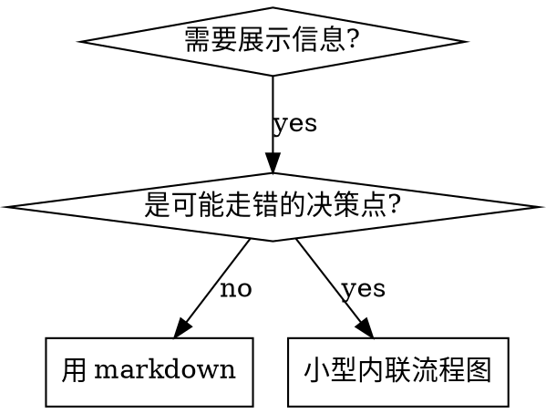

# Advanced Features（spec-skill 参考）

> 从 spec-skill 正文下沉的机制 / 进阶参考。spec-skill SKILL.md 的 `## Flowchart Usage` 与 `## Advanced Features` 指向本文件，按需 Read。

## 目录
- [Flowchart Usage](#flowchart-usage)（何时用 dot 图）
- [Cross-Model Compatibility](#cross-model-compatibility)（指令密度 / 停点 / 探索预算）
- [Dynamic Injection](#dynamic-injection-command)（`!command`）
- [Dynamic Routing](#dynamic-routing)
- [Sub-Files Strategy](#sub-files-strategy)
- [Subagent Collaboration](#subagent-collaboration)（模型分层 / Review 分层 / Capability Tiers / Background Checkpoint Gate）
- [Process Review Loop](#process-review-loop)

## Flowchart Usage

复杂分支、循环、状态机用 Graphviz dot 图表达决策点；纯参考材料、线性步骤、代码示例不用图（图烧 context，且不可复制粘贴）。

| 用 dot 流程图 | 不用流程图 |
|---|---|
| 非显而易见的决策点（"何时用 A vs B"） | 参考材料 → 用表格/列表 |
| 可能过早退出的处理循环 | 线性步骤 → 用编号列表 |
| 多状态流转 | 代码示例 → 用 markdown 代码块 |



节点 label 必须有语义，不用 step1/helper2 这类无意义标签。

## Cross-Model Compatibility

Skill 会被不同 LLM 执行（Claude Opus, Sonnet, MiniMax 等）。为最弱的模型设计。

**Instruction Density**：~1 concept per 6-8 lines——密度过高时弱模型容易丢失上下文。优先扁平结构而非深层嵌套（3-4 phases > 8 steps with sub-steps）。条件逻辑用表格，不用嵌套列表。

**Stop Points**：仅在用户输入会真正改变下一步动作时才停（向用户提问（结构化选项优先））。不必要的停止会打断流程。

反例: "Setup complete. Ready to continue?"（答案永远是 yes）
正例: "Which approach do you prefer? A or B?"（答案决定下一步）

**Exploration Budget**：涉及代码探索的步骤，添加预算规则防止漫无目的的搜索：

```markdown
**探索预算**：优先派发 Explore subagent，而非大量逐个工具调用。
若已做超过 10 次探索性工具调用仍无清晰假设，停下并向用户提一个澄清问题。
```

## Dynamic Injection (`!`command``)

Skill 加载时执行 shell 命令，输出替换占位符：

```markdown
- Tasks: !`hat-task-detect .tasks 2>/dev/null || echo '{"open":[]}'`
```

命令要轻量（毫秒级），注意工作目录。

**`!`cat`` 路径约定**：读取 skill 内部文件时，用 `${CLAUDE_SKILL_DIR}` 代替硬编码的项目根路径，skill 移动或在不同项目复用时自动适应：

```bash
# ✅ 同 skill 内文件
!`cat "${CLAUDE_SKILL_DIR}/references/lessons.md" 2>/dev/null || echo "(暂缺)"`

# ✅ 跨 skill 文件（如 revise 读 work 的 reference）
!`cat "${CLAUDE_PLUGIN_ROOT}/skills/work/references/protocol.md" 2>/dev/null || echo "(暂缺)"`

# ❌ 避免：硬编码项目根路径
!`cat ".claude/skills/work/references/lessons.md" 2>/dev/null || echo "(暂缺)"`
```

`${CLAUDE_SKILL_DIR}` 解析为 SKILL.md 所在目录的绝对路径，项目级与全局 skill 均适用（已验证）。

> 可移植路径的硬约束（不得含具体项目信息 / 本地绝对路径）作为审计相关 `<rule>` 保留在 spec-skill SKILL.md `## Advanced Features`，本文件只给机制说明。

## Dynamic Routing

**变量替换**：`$ARGUMENTS`（用户参数）、`$1`（位置参数）、`${CLAUDE_SKILL_DIR}`（skill 目录路径）。

**斜杠位置参数注入限制**（字面变量与两侧落点见 task 套件 harness-tools.md「斜杠位置参数注入」行）：该变量在 subagent 模式下为空字符串（2026-03-28 dogfooding 验证）。因此 subagent 调用 skill 时**必须使用路径 B**——直接在子代理 prompt 中注入 protocol 内容，不可依赖动态路由加载。

| 调用场景 | 路径 A（Skill 内部路由） | 路径 B（直接注入） |
|---------|----------------------|------------------|
| 主 session | ✅ 可用 | ✅ 可用 |
| Subagent | ❌ 变量为空 | ✅ 唯一可行方案 |

## Sub-Files Strategy

主 SKILL.md 保持精简骨架。子文件按预注入策略处理：

```
${CLAUDE_PLUGIN_ROOT}/skills/task/
├── SKILL.md                 ← 主流程骨架
├── DESIGN_PROTOCOL.md       ← !`cat` 预注入（关键子协议）
├── LINEAR_PROTOCOL.md       ← !`cat` 预注入（关键子协议）
└── scripts/                 ← 辅助脚本（如需要）
```

关键子协议文件必须通过 `!`cat`` 预注入（见 Pre-injection Strategy）。只有非关键的大型参考文档才按需 Read。

## Subagent Collaboration

**Plan 生成策略**：主 agent 直接编写 plan.md（Low/Medium 复杂度）。Subagent 仅在 High 复杂度且用户选择时使用。原因：实验数据显示主 agent token 消耗约为 subagent 的 1/24，质量差异主要在步骤粒度。

**执行模型分层**：

| 条件 | 模型 |
|------|------|
| Files ≤ 2 | Sonnet（默认） |
| Files 3+ **且**步骤含架构关键词 | Opus |

架构关键词（中英文）：设计/design、架构/architecture、重构/refactor、debug/调试。必须同时满足 Files 和关键词条件。

**Design Review 分层**：

| 轮次 | 用途 | 默认模型 |
|------|------|---------|
| R1（结构审查） | 架构一致性、coverage | Sonnet |
| R2（对抗审查） | 深度推理、边界情况 | Opus |

用户可在 Review Strategy Confirmation 步骤覆盖模型选择。

**Model Capability Tiers** — 派发 subagent 时根据模型能力调整注入内容：

| 层级 | 注入策略 |
|------|---------|
| **Strong** (Opus, GPT-4 级) | 核心约束 + 任务描述，精简信任推理 |
| **Medium** (Sonnet, MiniMax) | 核心约束 + 详细步骤 + XML 结构化 |
| **Weak** (Haiku 等) | 核心约束 + 逐步指令 + XML + trailing reminders + 更多示例 |

所有层级都避免 ALL CAPS。差异在于**详细度和结构化程度**，不在语气强度。越强的模型需要越简单的约束——过度约束导致分布偏移（Prompting Inversion）。

**Background Subagent Checkpoint Gate** — 后台任务必须有对应的 checkpoint gate。在下一个**用户交互点之前**插入验证，而非在后台任务本身加约束。保留并行效率，同时用 gate 确保完成。

| 模式 | 效果 | 示例 |
|------|------|------|
| 后台派发 + **阻塞 checkpoint** | ✅ 从未跳过 | `TaskOutput block:true` 在 Phase 1f |
| 后台派发 + 仅文字说明 | ❌ 系统性跳过 | Phase 3d 被跳过（ISSUE） |
| 后台派发 + **pre-gate before 向用户提问（结构化选项优先）** | ✅ 保留效率 | Phase 3 Stop 前检查 3d 完成 |

## Process Review Loop

在 task-end/task-cancel 的 final.md 中包含 token 估算、合规检查、偏差分析，然后和用户讨论改进：fix skill now / record to debt.md / skip。

如果任务中有 MCP 或脚本调用失败，Process Review 必须评估工具代码是否需要修复。
