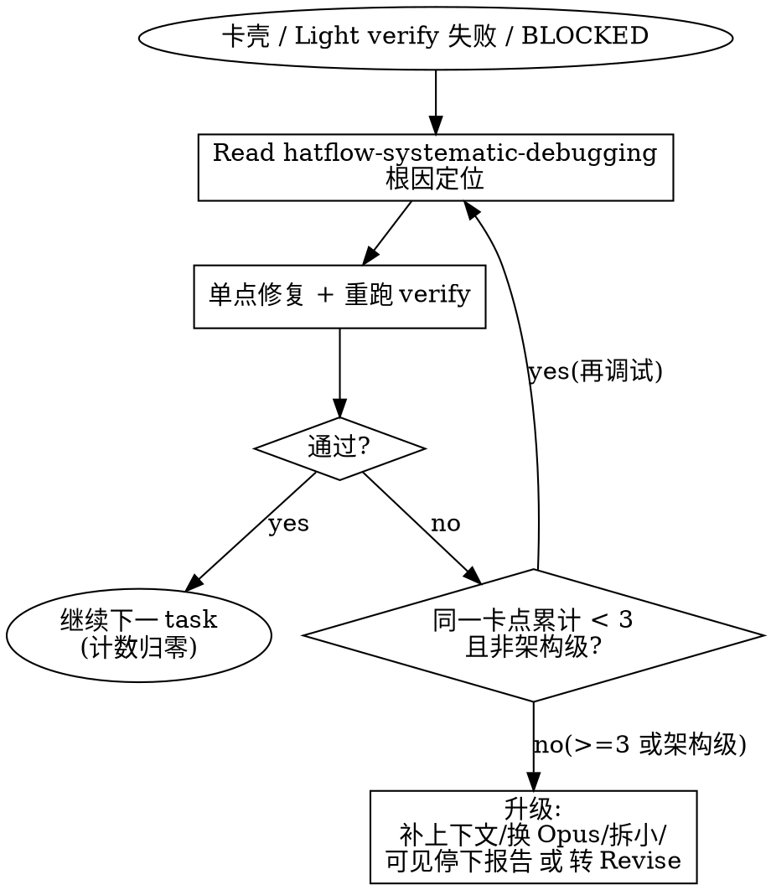

# Task Execute — Phase 4: Execute

任务执行阶段。主 session 协调逐个执行 plan.md 中的任务，每个任务后运行轻量验证，全部完成后运行代码审查。

**Announce at start:** "Using task-execute for Phase 4: Execute."

**LANGUAGE RULE — strictly enforced, no exceptions:**
Write every message you show to the user in the user's configured language (the project's language preference, e.g. via `/config` or CLAUDE.md). Technical terms and code identifiers stay in their original form.

## Runtime Context

- Tasks: !`hat-task-detect .tasks 2>/dev/null || echo '{"open":[]}'`
- Branch: !`git branch --show-current 2>/dev/null || echo 'NO_GIT'`
- Check (light): !`r=$(grep -A1 '轻量' CLAUDE.md 2>/dev/null | tail -1 | sed 's/^- //'); [ -n "$r" ] && echo "$r" || echo 'NOT_CONFIGURED'`
- Check (full): !`r=$(grep -A1 '完整' CLAUDE.md 2>/dev/null | tail -1 | sed 's/^- //'); [ -n "$r" ] && echo "$r" || echo 'NOT_CONFIGURED'`

## Red Flags

| If you think... | Reality |
|---|---|
| "All tasks done, I'll jump to test/end" | Phase 4 only handles execution + code review. Phase 5 (Test) is a separate skill. |
| "Light verification passed, skip code review" | Verification and code review are separate gates. Both must run (per complexity). |
| "The TDD RED step passed — great, move on" | A passing RED step is an anomaly. Stop and report to user. |
| "The fix is obvious, commit without user confirmation" | During review phase: analyze → fix → user tests → user confirms → THEN commit. |

---

## TODO Sync

### Bootstrap（执行开始时）

`TaskList` 检查当前 Phase 的 step 级 task 是否存在。若不存在（session 恢复或 context compaction），**先**从 phases.md 重建概览行（确保拿到最小 ID 以固定在首行）并**立即** `TaskUpdate(status: "in_progress")`，**再**创建 step 级 task。

**Phase 4 的 step 级 task 展开规则**：解析 `{task-folder}/plan.md`，为每个 plan task 创建独立的 step 级 TODO（而非只创建 `4a` 和 `4b` 两项）。格式：

```
◼ [任务名] ✔P1:Init ✔P2:Design ✔P3:Plan ▶P4:Execute ◻P5:Test ◻P6:End
◻ → Task 1: [标题]
◻ → Task 2: [标题]
◻ → ...
◻ → Task N: [标题]
◻ → 4b. 代码 review
```

每个 plan task 对应一个 `TaskCreate`，metadata 为 `{"level": "step", "phaseNum": 4, "stepId": "4a-taskN"}`。`4b. 代码 review` 作为最后一个 step 级 task。

已完成的 plan task 标记 `completed`（根据 plan.md 中的 checkbox 状态判断，或根据 Commit Checkpoint 推断）。

### 执行中更新

每个 plan task 开始时 `TaskUpdate(status: "in_progress")`，完成时 `TaskUpdate(status: "completed")`。4b 步骤同理。

### TODO 瘦身（减少往返）

- **Phase 切换的 delete/create 批量并行**：单条消息内多个 `TaskUpdate`/`TaskCreate`，不要一条一条来回。
- **快步骤可只标 `completed`**，省去先 `in_progress` 再 `completed` 的双往返（仅对耗时可忽略、无需展示进行中的步骤）。
- **Phase 4 step 粒度按 tier 裁剪/聚合**：lite/hotfix 档可把所有 plan task 聚合为单条 `4a` step，不逐 task 建 TODO；full/standard 档才逐 task 展开。

---

## Resume Support

如果 phases.md 存在且 Phase 4 已有已完成的步骤（`[x]`），跳过这些步骤直接从第一个未完成步骤继续。

**phases.md 中 Phase 4 步骤对应：**
- `4a. 执行任务` → Step 4a（包含所有 plan tasks）
- `4b. 代码 review` → Step 4b

**Task folder path**: 从 Runtime Context Tasks JSON 的 `open[0].path` 获取。

---

## Process

### Unattended State（每次执行时加载）

1. **读取无人值守状态**：`cat "{open[0].path}/unattended.json" 2>/dev/null`
2. **若 enabled == true**：
   - 执行 `Read ${CLAUDE_PLUGIN_ROOT}/skills/task/UNATTENDED_PROTOCOL.md`，加载完整协议
   - 读取全局配置：`cat ${CLAUDE_PLUGIN_ROOT}/skills/task/task-defaults.json`（不存在则从 `.example` 复制），解析为 `task_config`
3. **若文件不存在或 enabled != true**：正常交互流程（引擎和 reviewer 从 `design.md` 读取——Design 阶段已确认）

> 无人值守模式的激活（unattended.json 创建）统一由 `/task` 编排器的 Step 2A.1 处理。各阶段 skill 仅负责读取已有状态。
> `task_config` 仅在 Unattended 模式下由 task-execute 直接读取。Interactive 模式下，用户在 Design 阶段 Step 6.5 已基于 `task_config` 推荐值做出选择并写入 `design.md`，task-execute 读取 `design.md` 即可。

---

### P4 起始时间戳（core timing，内联）

内联记录 phase_start（须在本 phase 任何 `hat-plugin-hook` 调用之前；helper 自带顶层 `observability.enabled` 门控，关闭档 → no-op）：

```bash
hat-timing-stamp {task-folder} phase_start P4
```

### 4a. Execution

主 session 协调执行 plan.md 中的任务。读取 `{task-folder}/task-config.json` 确定执行模式。

#### 执行模式分支

| Mode | 行为 |
|------|------|
| **auto** | 按批次决策：独立批次（同层 2+ 个互无依赖 task）→ parallel-agents 派发；耦合链 / 单 task → inline。 |
| **inline** | 主 agent 按 plan 顺序直接执行，不派发 subagent。逐个 task 完成，保留完整对话历史。 |
| **parallel-agents** | 偏向派发：凡可隔离的 task 都派 task-executor subagent；仅耦合链回退 inline。 |

**来源**：读取 `task-config.json` 的 `execution.mode`。

<rule>
Any unrecognized mode value (including the legacy `subagent`) MUST fall back to `inline`.
Reason: `subagent` 是旧 schema 值，已被 auto/parallel-agents 取代；遇未知 mode 时静默并行或直接报错都会破坏执行，退化为 inline 最安全——主 agent 串行执行、行为确定。
</rule>

#### auto / parallel-agents 分层调度

```
layers = topological_layers(tasks)   # 按 plan 的 Depends 字段拓扑分批
for layer in layers:
  # auto：仅 2+ 互无依赖的独立批次才派发；parallel-agents：任何可隔离 task（含单 task 层）都派发
  should_dispatch = (mode == "auto"            and len(layer) >= 2) \
                 or (mode == "parallel-agents" and layer_is_isolatable(layer))
  if mode == "inline" or not should_dispatch:
    for task in layer: run_inline(task)        # 串行，主 agent 直接执行
  else:
    Read ${CLAUDE_PLUGIN_ROOT}/skills/hatflow-dispatching-parallel-agents/SKILL.md   # 取并行派发纪律
    for task in layer (up to 3 parallel):
      model = route_model(task)                # 见下方「模型自动分流」
      dispatch task-executor(subagent_type=task-executor, model=model,
                             prompt = IMPLEMENTER_PROMPT.md 全文
                                    + 该 task 的 plan 段落 + Guardrails
                                    + TDD 指令)
    await_all(layer); handle_hooks_and_checkpoints(results)
```

**约束**：
- 同层最大并行 3（超出则分多批）。
- **`layer_is_isolatable(layer)` 判据**：层内每个 task 的 `Depends` 都已全部完成（无未满足的跨层依赖）**且** task 间改动文件集互不重叠（写同一文件的 task 不并行，避免写冲突）**且** 通过**契约完整性核验**（见下）。单 task 层只要满足这些也算可隔离——故 parallel-agents 对单 task 层也派发，auto 仅对 `len(layer) >= 2` 的独立批次派发。
- **契约完整性核验门（并行前必过，否则该层退 inline）**：检查本层各 task 的 plan `Files` 声明是否标注了「契约另一端」（被改动文件引用、或引用改动文件的相邻文件）。**已知盲区（debt B2）**：两个 task 各改各的文件，却共享一个契约（如 task A 改某文件的输出格式，task B 所改文件消费该格式），而契约另一端**未出现在任何 task 的 Files 列表**——此时「文件集不重叠」为假独立，并行会留下悬空引用。核验：若 plan File Structure 已按 PLAN_PROMPT「列出相邻契约文件」标注了契约另一端、且本层 task 不共享未声明的契约 → 通过并行；否则**退化为 inline**（宁可串行，不赌未声明的契约）。此门承接/收敛 debt B2，**不引入新机制**（仅一道读 plan Files 声明的判断）。
- **缺 `Depends` 字段** → 无法判定独立性 → 全部视为顺序 → 串行 inline 退化。
- 派发的 task-executor 注入 `IMPLEMENTER_PROMPT.md` 全文（不让 subagent 去读 plan 文件）。
- mode=inline 忽略 Difficulty/Depends，纯按 plan 顺序串行。

#### 模型自动分流（engine=auto，仅作用于被派发的 task）

`route_model(task)` = f(难度, TDD mode, 复杂度/影响面)，优先级 **架构 override > TDD 加权 > 难度基线**：

| 信号 | 规则 |
|------|------|
| 难度基线 | easy/medium → Sonnet；hard → Opus |
| TDD 加权 | tdd.mode=full 且 hard 且**无**架构触发（机械型，spec 清晰 + 红绿灯兜底）→ 降 Sonnet |
| 架构 override（最高优先级，**即"复杂度/影响面"信号的落地**） | task 触 3+ 文件 **或** 含架构关键词（设计/架构/重构/状态机/调度/路由）→ Opus，**不被 TDD 权重压下** |

> 公式里的"复杂度/影响面"参数即由**架构 override 行**承载（文件数 + 架构关键词作复杂度代理），不是独立的第四档——避免读者找不到它如何作用。

- engine=sonnet / opus：全部用该模型，不做 per-task 选型。
- **inline task 跑主 agent 当前模型**，不做 per-task 选型。
- **成本依据**：执行大头走 Sonnet（≈ Opus 1/5 价）；parallel-agents 只省墙钟、不减 token 总量；前提是 plan 任务已切细自足。

#### 执行循环（每个 plan task）

1. 将当前任务标记为 in_progress（TODO Sync）
2. **P4.per-task-pre：内联 timing + hook**：
   先内联记录 task_start（core timing，须在 hook 之前），再运行 hook：
   ```bash
   hat-timing-stamp {task-folder} task_start P4 task="Task N"
   hat-plugin-hook {task-folder} P4.per-task-pre
   ```
   hook 输出按段全部执行（tdd: TDD 循环指令注入）。tdd 禁用时该点天然输出空、跳过（无需额外条件化逻辑）。
3. 执行任务（inline 直接执行 / auto·parallel-agents 派发 task-executor）。派发时 prompt 注入：
   - `IMPLEMENTER_PROMPT.md` 全文（实现者纪律单一事实源）
   - plan.md 中当前 task 的 Steps + Implementation Guardrails
   - TDD 指令（由 P4.per-task-pre 的 tdd 段提供）
   - `Report your status as one of: DONE, DONE_WITH_CONCERNS, NEEDS_CONTEXT, BLOCKED.`
4. 处理返回状态：

| Status | 处理 |
|--------|------|
| **DONE** | 继续 |
| **DONE_WITH_CONCERNS** | 正确性问题 → 先解决；观察性 → 记录 |
| **NEEDS_CONTEXT** | 主 agent 提供上下文，重派（最多 2 次） |
| **BLOCKED** | 走 **卡壳升级阶梯**（见下）——非立即上报，先经根因调试 |

5. 运行 **Light verification**（Runtime Context 中的 Check (light) 命令）
6. **P4.per-task-post：内联 timing + hook**：
   先内联记录 task_end（core timing，`status` 取执行结果 done/error；须在 hook 的 tdd RED 检测之前），再运行 hook：
   ```bash
   hat-timing-stamp {task-folder} task_end P4 task="Task N" status=done   # status 取执行结果：成功 done / 出错或 BLOCKED error
   hat-plugin-hook {task-folder} P4.per-task-post
   ```
   hook 输出按段全部执行（顺序：tdd: RED 异常检测 + tdd_cycle timing 记录 → review: per-task review → git: formatter → git: commit checkpoint）。obs 的 `task_end` 与 tdd 的 `tdd_cycle` 是两个不同事件，各写一行、不撞名。
7. 将任务标记为 completed
8. 重复直到所有任务完成

**If Light verification is not configured**: **静默跳过验证、不询问**（约定 9 Interaction Front-Loading：Execute 零阻塞交互）。验证命令应已在 Design 阶段前置确定（写入 task-config check 字段 / CLAUDE.md 验证命令节）；Execute 阶段未配置即视为「无 light 验证」，直接继续。

#### 卡壳升级阶梯

Light verify 失败、或 inline 卡壳、或被派发 task-executor 返回 BLOCKED，统一走这条阶梯——**先根因调试，不要一卡就上报或一卡就换模型**。

1. `Read ${CLAUDE_PLUGIN_ROOT}/skills/hatflow-systematic-debugging/SKILL.md`（Iron Law：无根因不修——先复现/定位，再动手）。
2. 按根因做**单点修复**，重跑 verify。
3. **计数 per stuck-point**（同一 task 内同一卡点累计；换到下一个 task 时归零）：
   - **计数由主 agent 在会话上下文维护**——被派发的 task-executor 是无状态实例，每次重派不记得上一轮，故计数器只能在主 agent 侧。每次 BLOCKED 返回或 inline 卡死时，先比对卡点描述是否与上次同一（同 task + 同根因症状），是则计数 +1，否则视为新卡点从 1 起算。
   - **< 3 次** → 回到本阶梯第 1 步（hatflow-systematic-debugging 的根因定位，**不是** task 的 Phase 1 Init）继续调试。
   - **≥ 3 次，或判定为架构级问题** → 升级。
4. **升级动作**（subagent BLOCKED 与 inline 卡死同属此阶梯，只是表达形式不同）：补上下文重派 → 换更强模型（Sonnet→Opus）重试一次 → 拆小 task → 仍无解则按模式终结（**不弹要求应答的阻塞菜单**——约定 9：Execute 零阻塞交互）：
   - **[Interactive]** 在 session 内**可见地停下并输出清晰报告**（卡点描述 + 已尝试的根因修复 + 建议的下一步如转 Revise/拆分），phases.md 状态不变，用户回来后 `/task` 恢复或决策。Telegram 通知为 best-effort **叠加**（有 chat_id 则发），不替代可见停止。
   - **[Unattended]** 按硬判据二选一：
     - 命中**系统性问题**（涉及 design 假设偏差 / 跨模块契约变更 / plan 任务边界需要重划）→ 转 Revise。
     - 否则（局部实现卡点、非架构级）→ Telegram 通知后 auto-cancel。



完成后（所有 plan tasks 执行完）：更新 phases.md，将 `4a. 执行任务` 标记为 `[x]`。

### P4.post-execute Hook（4b. 代码 review）

所有 task 完成后，运行：

```bash
hat-plugin-hook {task-folder} P4.post-execute
```

hook 输出包含多段指令，**必须逐段全部执行**（顺序：review: 全量代码审查 → review: Revise 触发检测）。

<rule>
All instruction segments output by P4.post-execute hook must be executed in order (full-review → revise-detection). Do NOT mark 4b as complete after finishing only the full-review segment.
Reason: partial hook execution silently drops the revise-detection segment, so systemic issues that should trigger a Revise Cycle go undetected.
</rule>

**核心行为保留**：
- Revise Cycle 检测：核心步骤 4a 进入时先检查 phases.md 是否有 IN_PROGRESS 的 Revise section
- 回归模式：检查 4b 是否有 `[→ REVISE RN]` 标记，如有则限定 review scope
- 回归模式下 Return 步骤标记由 task-execute 负责

**4b 收敛是跨回合异步 join 循环**（机制单一来源 = `review.md ## P4.post-execute/convergence`，此处仅接线、不重述）：
- 收敛场景下 Round 1 reviewer 用 `run_in_background=true` 派发、捕获 agentId；主线程派发/复活后**结束本回合**，completion notification 按 `task-id` 重入累积，收齐「期待 agentId 集合」才推进判 C/I（未命中的 linear-sync / 用户 notification 正常吸收、不推进）。
- agent→{维度}→agentId 映射写入 phases.md 4b 行 `[→ 收敛 Rn agents:...]` 标注。该标注与既有 `[→ REVISE RN]` 回归标注**互斥**（收敛是 revise 的前置，进入 Revise 即清收敛标注）；上方「回归模式检测」精确匹配 `REVISE` 前缀，不会误捕 `收敛`。
- **进入 4b 的标注分诊（resume / compaction / 首次统一适用）**：读 phases.md 4b 行标注，按固定优先级判定入口——① 有 `[→ REVISE RN]` → 回归模式（见上方「回归模式检测」）；② 否则有 `[→ 收敛 Rn agents:...]` → 按下条 resume/compaction 重入恢复 agentId；③ 二者皆无 → 正常首轮。二者互斥（至多一个标注），此优先级把「不并存」升级为显式分诊顺序，消除 resume 入口歧义。
- **resume / 同 session compaction 重入**：从 `[→ 收敛 Rn agents:...]` 标注恢复 agentId 尝试复活；agentId 已失效（agent 已死 / resume 新 session）则该维度全新派发（兜底详见 review.md convergence「状态存储 + 降级兜底」）。

完成后（非 revise 触发路径）：更新 phases.md，将 `4b. 代码 review` 标记为 `[x]`。

### P4 结束时间戳（core timing，内联）

返回编排器前内联记录 phase_end：

```bash
hat-timing-stamp {task-folder} phase_end P4
```

<rule>
返回编排器前应内联 `hat-timing-stamp {task-folder} phase_end P4`。helper 自带 `observability.enabled` 门控（关闭档 → no-op）。
Reason: 内联后是确定动作（不再依赖读 hook 文本指令后手写）；缺 phase_end 仅触发编排器 Step 1.5 产物门控的非阻断警告（不 self-brick），但应执行以保 observability 完整。
</rule>

### Execute 完成 → 过渡

Phase 4 完成，phases.md 已更新。

用用户配置的语言简要宣告执行结果（执行的 task 数量、code review 状态），然后声明：**"Execute 完成。"** 此处停止输出，返回编排器 Step 3 执行过渡逻辑。

<rule>
Phase skill 完成后必须返回编排器 Step 3。不得在 transition section 中提示用户调用 `/task-end`、`/task-test` 或任何其他 skill。过渡路由（产物检查、compact 建议、unattended 检查等）是编排器的职责。
Reason: 阶段 skill 不知道完整的过渡逻辑（phase_merge、compact、unattended 等），自行发出过渡指示会跳过这些检查。
</rule>

---

## phases.md Sync

每个步骤完成后更新 phases.md。每次更新步骤标记时，同步更新 `**Updated**` 时间为当前时间（格式 YYYY-MM-DD HH:MM）。

**Phase 4 完成时**：将 Phase 4 的 `**Status**: PENDING` 改为 `**Status**: DONE`，更新 `**Updated**` 时间。

**Revise 触发时**：Phase 4 的 Status **保持 `IN_PROGRESS`**，不标记为 DONE。

**4b 回归模式优先**：进入 4b 时，先检查 phases.md 中 4b 是否有 `[→ REVISE RN]` 标记。如有，直接进入回归模式。

---

## Mandatory Stop Points

> **约定 9 Interaction Front-Loading**：Execute(P4) 零阻塞交互。下表无「要求用户应答才能继续」的停顿点——P4 不弹 AskUserQuestion。

| Step | When | 行为（非阻塞） |
|------|------|-------------|
| 4a | Light verification 未配置 | **静默跳过验证**，不询问（验证命令前置到 Design 决定） |
| 4a | 卡壳升级阶梯 ≥3 次或架构级问题（含 subagent BLOCKED 升级末端） | **[Interactive]** session 内可见停下 + 报告（不弹菜单）；**[Unattended]** 转 Revise 或 Telegram 通知后 auto-cancel |

## Dependencies

- **Reads**: `{task-folder}/plan.md`, `{task-folder}/task-config.json`
- **Writes**: `{task-folder}/phases.md`
- **Injects（派发 task-executor 时）**: `IMPLEMENTER_PROMPT.md`（全文注入实现者 prompt）
- **References**: `hatflow-dispatching-parallel-agents`（独立批次并行派发纪律）, `hatflow-systematic-debugging`（卡壳升级阶梯根因定位）
- **Hooks**: `P4.per-task-pre`（tdd）, `P4.per-task-post`（tdd + review + git）, `P4.post-execute`（review）
- **Core timing**（内联，非 hook）: phase_start P4（阶段开始）/ task_start P4（每 task 前）/ task_end P4（每 task 后、hook 之前）/ phase_end P4（返回编排器前）经 `hat-timing-stamp`，受顶层 `observability.enabled` 门控
- **Scripts**: hat-plugin-hook, hat-timing-stamp
